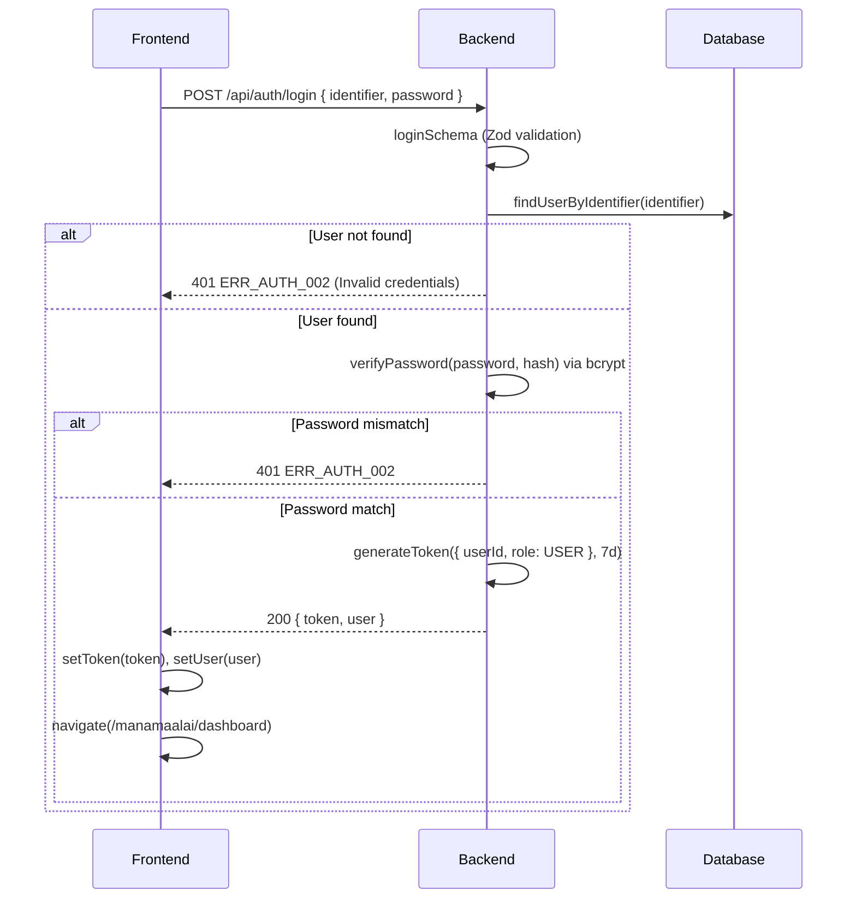
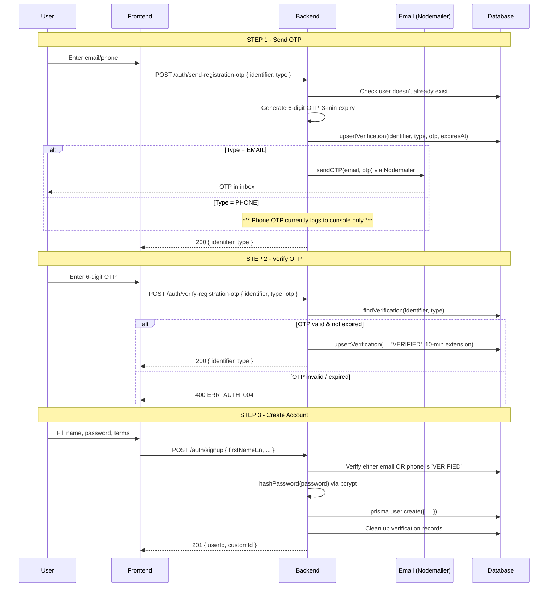
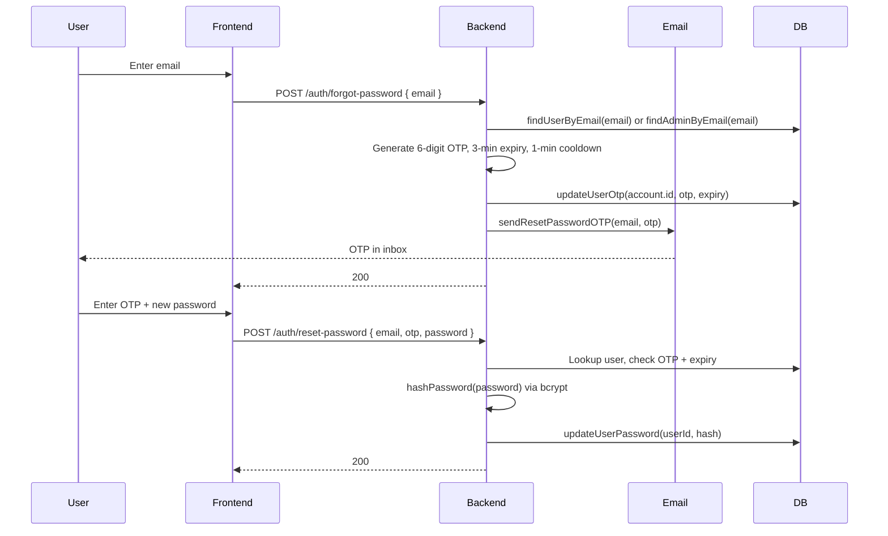
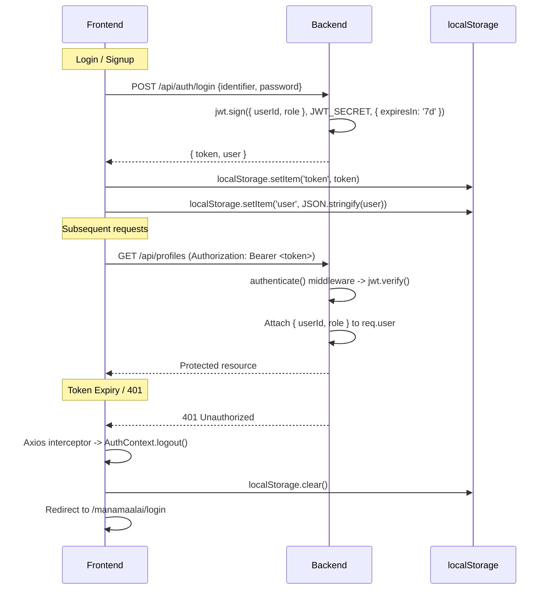
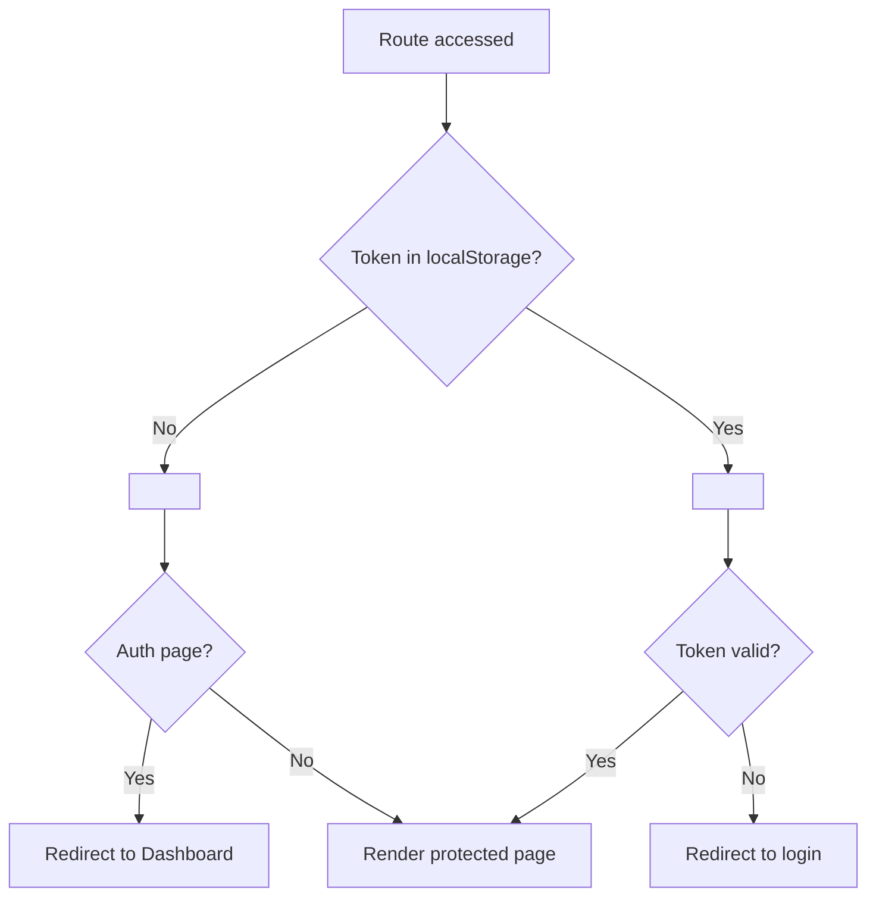

# Authentication Architecture

## Overview

The auth system uses a **custom JWT-based authentication** with separate User and Admin tables. The architecture is designed around an **extensible Provider Strategy Pattern** that allows new authentication methods (Google OAuth, phone OTP, etc.) to be added with minimal code changes.

---

## Table of Contents

1. [Current Auth Flows](#current-auth-flows)
   - [Login (Password)](#login-password)
   - [Admin Login](#admin-login)
   - [Signup (2-Step OTP)](#signup-2-step-otp)
   - [Forgot / Reset Password](#forgot--reset-password)
2. [OTP Flow](#otp-flow)
3. [JWT Token Lifecycle](#jwt-token-lifecycle)
4. [Auth Middleware Chain](#auth-middleware-chain)
5. [RBAC Matrix](#rbac-matrix)
6. [Frontend Route Protection](#frontend-route-protection)
7. [Provider Strategy Pattern](#provider-strategy-pattern)
8. [File Inventory](#file-inventory)
9. [Security Considerations](#security-considerations)

---

## Current Auth Flows

### Login (Password)

```
ENDPOINT: POST /api/auth/login
BODY:     { identifier: string (email or phone), password: string }
CONTROLLER: authController.login -> performLogin(req, res, 'USER')
```



**Key logic** (`controllers/auth.ts:137-199`):
- Looks up both `User` and `Admin` tables
- For USER portal: blocks ADMIN accounts (`ERR_AUTH_007`)
- Accepts email OR phone as identifier (auto-detected by `@` symbol)
- JWT payload: `{ userId, role }` -- 7-day expiry

### Admin Login

```
ENDPOINT: POST /api/auth/admin-login
BODY:     { identifier, password }
CONTROLLER: authController.adminLogin -> performLogin(req, res, 'ADMIN')
```

Same flow as user login but:
- Checks Admin table first
- Allows non-USER roles
- Blocks USER-only accounts (`ERR_AUTH_007`)

### Signup (2-Step OTP)

```
STEP 1: POST /api/auth/send-registration-otp  { identifier, type: 'EMAIL'|'PHONE' }
STEP 2: POST /api/auth/verify-registration-otp { identifier, type, otp }
STEP 3: POST /api/auth/signup                  { firstNameEn, lastNameEn, firstNameTa, lastNameTa, email, phone, password }
```



**Known gap**: Phone OTP is not delivered via SMS -- only logged to console (`controllers/auth.ts:413`).

### Forgot / Reset Password

```
STEP 1: POST /api/auth/forgot-password  { email }
STEP 2: POST /api/auth/reset-password   { email, otp, password }
```



---

## OTP Flow

```
Verification Table (prisma)

  id          String   @id @default(uuid())
  identifier  String                     (email or phone number)
  type        String                     ("EMAIL" | "PHONE")
  otp         String                     (plaintext OTP)
  expiresAt   DateTime
  createdAt   DateTime @default(now())
  @@unique([identifier, type])
```

**OTP lifecycle:**
1. `sendRegistrationOtp` -> creates/updates record with 3-min expiry
2. `verifyRegistrationOtp` -> marks record as `VERIFIED` with 10-min extension
3. `signup` -> checks for `VERIFIED` status, then deletes record

**For existing users** (`forgotPassword` / `sendOtp` / `verifyOtp`):
- OTP is stored directly on the `User` or `Admin` record (`otp`, `otpExpiry` fields)

---

## JWT Token Lifecycle



**Token details:**
- Algorithm: `HS256`
- Payload: `{ userId, role }`
- Expiry: 7 days
- Storage: `localStorage` (token + serialized user)
- No refresh token mechanism (stateless JWTs)

---

## Auth Middleware Chain

```typescript
// backend/src/middlewares/auth.ts

// 1. authenticate -- REQUIRED auth
//   Reads Bearer token, jwt.verify(), returns 401 if invalid
//   Attaches { userId, role } to req.user

// 2. authorizeAdmin -- ADMIN-only gate
//   Checks req.user.role === 'ADMIN', returns 403 if not

// 3. optionalAuthenticate -- OPTIONAL auth
//   Tries to decode token if present, silently continues if absent
```

---

## RBAC Matrix

| Route Pattern | Middleware | Access |
|---|---|---|
| `/api/auth/*` | None | Public |
| `/api/profiles` (GET browse) | `optionalAuthenticate` | All |
| `/api/profiles` (POST) | `authenticate` | USER only |
| `/api/profiles/:id` (PATCH) | `authenticate` | OWNER only |
| `/api/profiles/:id/status` (PATCH) | `authenticate` + `authorizeAdmin` | ADMIN only |
| `/api/admin/*` | `authenticate` + `authorizeAdmin` | ADMIN only |
| `/api/shortlist/*` | `authenticate` | USER only |
| `/api/settings/change-password` | `authenticate` | USER/ADMIN |

---

## Frontend Route Protection



---

## Provider Strategy Pattern

To support future auth providers (Google OAuth, phone OTP, Apple, Facebook, etc.), the backend uses a **Strategy Pattern** with a provider registry.

### Interface Definition

```typescript
// backend/src/services/auth/providers/types.ts

export enum AuthProviderType {
  PASSWORD = 'PASSWORD',
  GOOGLE   = 'GOOGLE',
  PHONE    = 'PHONE',
  // Future: FACEBOOK, APPLE, etc.
}

export enum AuthPortal {
  USER  = 'USER',
  ADMIN = 'ADMIN',
}

export interface AuthProvider {
  type: AuthProviderType;

  /**
   * Authenticate or register a user via this provider.
   *
   * For PASSWORD: verify identifier + password via bcrypt
   * For GOOGLE:   verify idToken via Google Auth Library
   * For PHONE:    verify OTP via SMS provider
   */
  authenticate(credentials: any, portal: AuthPortal): Promise<AuthResult>;
}

export interface AuthResult {
  userId: string;
  providerType: AuthProviderType;
  providerUserId?: string;     // OAuth provider's user ID (Google sub)
  email?: string;
  phone?: string;
  isNewUser: boolean;          // true if account was just created
  portal: AuthPortal;
  profile: { firstNameEn?: string; lastNameEn?: string; };
}
```

### Prisma Schema Updates

```prisma
enum AuthProviderType {
  PASSWORD
  GOOGLE
  PHONE
}

model User {
  // ... existing fields ...
  authProvider    AuthProviderType @default(PASSWORD)
  providerId      String?              // OAuth provider's user ID
  password        String?              // nullable for OAuth-only users
  @@unique([authProvider, providerId])
}

model Admin {
  // ... existing fields ...
  authProvider    AuthProviderType @default(PASSWORD)
  providerId      String?
  @@unique([authProvider, providerId])
}
```

### Unified Auth API

New endpoints that delegate to the provider strategy:

```
POST /api/auth/authenticate
  Body: { provider: 'PASSWORD', portal: 'USER', credentials: { identifier, password } }
  Body: { provider: 'GOOGLE',   portal: 'USER', credentials: { idToken } }
  Body: { provider: 'PHONE',    portal: 'USER', credentials: { phone, otp } }
  Response: { token, user, provider }

POST /api/auth/register
  Body: { provider: 'GOOGLE', credentials: { idToken }, profile: { firstNameEn, ... } }
  Body: { provider: 'PHONE',  credentials: { phone, otp }, profile: { firstNameEn, ... } }
  Response: { token, user, provider }
```

**Controller logic:**
```typescript
async function authenticate(req: Request, res: Response) {
  const { provider: providerType, portal, credentials } = req.body;
  const provider = authProviderFactory.get(providerType);
  const result = await provider.authenticate(credentials, portal || AuthPortal.USER);
  const token = generateToken({ userId: result.userId, role: portal });
  return sendSuccess(res, { token, user: await formatUser(result) });
}
```

### Provider Factory

```typescript
// backend/src/services/auth/providers/index.ts

class AuthProviderFactory {
  private providers = new Map<AuthProviderType, AuthProvider>();

  register(provider: AuthProvider): void {
    this.providers.set(provider.type, provider);
  }

  get(type: AuthProviderType): AuthProvider {
    const provider = this.providers.get(type);
    if (!provider) throw new Error(`Unknown auth provider: ${type}`);
    return provider;
  }
}

export const authProviderFactory = new AuthProviderFactory();

// Register built-in providers
authProviderFactory.register(new PasswordAuthProvider());
authProviderFactory.register(new GoogleAuthProvider());
authProviderFactory.register(new PhoneAuthProvider());
```

### Frontend Provider Registry

```typescript
// frontend/src/auth/providers/types.ts

export interface AuthProviderConfig {
  id: AuthProviderType;
  name: string;
  icon: string;
  component: React.ComponentType<ProviderButtonProps>;
  color?: string;
}

export interface ProviderButtonProps {
  onSuccess: (token: string, user: User) => void;
  onError: (error: any) => void;
  isLoading?: boolean;
}
```

```typescript
// frontend/src/auth/providers/registry.ts

export const authProviderConfigs: AuthProviderConfig[] = [
  { id: AuthProviderType.PASSWORD, name: 'Email',  icon: 'mail',     component: PasswordLoginForm },
  { id: AuthProviderType.GOOGLE,   name: 'Google', icon: '/google.svg',  component: GoogleLoginButton },
  { id: AuthProviderType.PHONE,    name: 'Phone',  icon: 'phone',    component: PhoneLoginForm },
];
```

**Login page renders dynamically:**
```tsx
<div className="auth-providers">
  {authProviderConfigs.map((config) => (
    <config.component key={config.id} onSuccess={handleAuthSuccess} onError={handleAuthError} />
  ))}
</div>
```

### Adding a New Provider

| Step | Backend | Frontend |
|------|---------|----------|
| 1 | Create `providers/facebook.ts` implementing `AuthProvider` | -- |
| 2 | Register in `providers/index.ts` factory | -- |
| 3 | -- | Create `FacebookLoginButton.tsx` |
| 4 | -- | Add entry to `providers/registry.ts` |

No changes needed to routes, controllers, middleware, or existing components.

---

## File Inventory

### Backend Auth Files

| File | Purpose |
|---|---|
| `controllers/auth.ts` | 9 auth endpoints |
| `services/auth.ts` | Common utils: password hash, JWT, DB lookups |
| `services/email.ts` | Nodemailer transport + templates |
| `services/auth/providers/` | Provider strategies + factory (planned) |
| `routes/auth.ts` | 9 POST route definitions |
| `middlewares/auth.ts` | authenticate, authorizeAdmin, optionalAuthenticate |
| `utils/validators/auth.ts` | Zod schemas for all endpoints |
| `utils/errors.ts` | Error codes (ERR_AUTH_001-008) |
| `prisma/schema.prisma` | User, Admin, Verification models |

### Frontend Auth Files

| File | Purpose |
|---|---|
| `context/AuthContext.tsx` | Auth state, localStorage sync |
| `api/auth.api.ts` | 7 API functions |
| `hooks/auth/useAuth.ts` | 7 TanStack Query mutations |
| `types/auth.ts` | User, Admin, LoginData, SignupData, ApiResponse |
| `lib/api.ts` | Axios instance + interceptors |
| `utils/validators/auth.ts` | Client-side validation |
| `auth/providers/` | Provider types, registry, hook (planned) |
| `pages/auth/Login.tsx` | Login page |
| `pages/auth/Signup.tsx` | Signup page |
| `pages/auth/ForgotPassword.tsx` | Forgot password page |
| `pages/auth/AdminLogin.tsx` | Admin login page |

---

## Security Considerations

| Concern | Mitigation |
|---|---|
| XSS / Token theft | Input sanitization, CSP headers |
| Token in URL | Authorization header only, never query params |
| Password brute force | bcryptjs cost 10+, rate limiting |
| OTP interception | Sent to registered email only; 3-min TTL, 1-min cooldown |
| Session fixation | New JWT on every login |
| Admin escalation | `authorizeAdmin` middleware on all admin routes |
| Signup verification | Email OR phone must be verified before account creation |

---

## What NOT To Do

- Do NOT store JWT in cookies (CSRF vulnerable)
- Do NOT implement refresh tokens without understanding implications
- Do NOT expose passwords in API responses
- Do NOT skip auth middleware on user data routes
- Do NOT log JWT tokens or passwords
- Do NOT manually register providers in controller logic -- always use `AuthProviderFactory`
- Do NOT store provider-specific logic in the factory or controller
