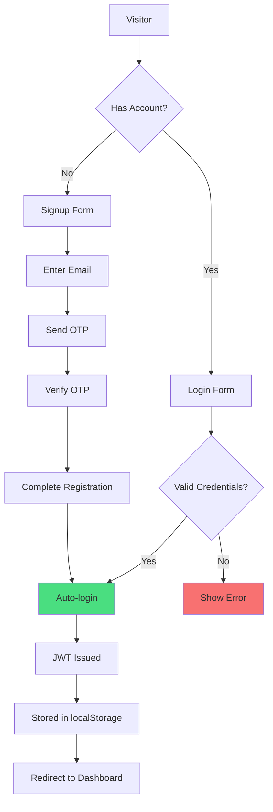
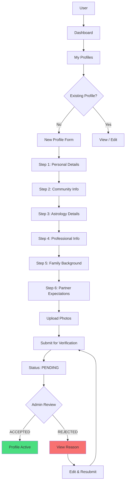
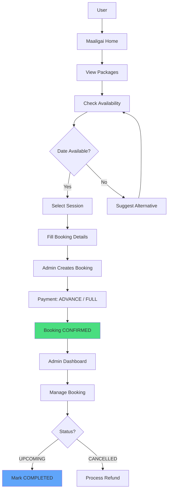
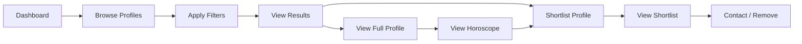

# Product & Business Understanding

## What the Product Does

A **bilingual (Tamil/English)** platform serving two distinct but related businesses:

1. **Matrimony (மணமாலை)** — A community-specific matchmaking platform for the Kongu Vellalar community. Users create biodata profiles, browse matches, shortlist candidates, and contact prospects.
2. **Mandapam (மாளிகை)** — A temple wedding hall booking system. Users view packages, check availability, book sessions, and manage payments.

Both products serve the **Mohanur Kongu Vellalar Temple** ecosystem, combining community matchmaking with physical venue booking.

## Business Goals

1. **Increase successful matches** within the Kongu Vellalar community
2. **Monetize premium matrimony features** (profile visibility, advanced filters)
3. **Digitize mandapam booking** — eliminate phone/paper-based booking
4. **Prevent double-booking** of hall sessions
5. **Generate temple revenue** through hall bookings and premium plan sales
6. **Preserve community data** — detailed profile, family, and astrology information

## User Types

| Role | Description | Access Level |
|---|---|---|
| **Visitor** | Unauthenticated user browsing public pages | Landing, Maaligai info, Login/Signup |
| **User (Basic)** | Registered user with FREE plan | Browse profiles (limited), shortlist (limited), create 1 profile |
| **User (Premium)** | Paid subscriber | Unlimited browsing, advanced filters, suggested matches, priority |
| **Admin** | Temple staff managing operations | Profile verification, user management, mandapam bookings, analytics |
| **Super Admin** | Full system control | All admin + settings, premium pricing, system config |

## Major Workflows

### 1. Authentication Flow

### 2. Profile Creation Flow

### 3. Mandapam Booking Flow

### 4. Browse & Shortlist Flow

## Business Rules

| Rule | Enforcement Point | Rationale |
|---|---|---|
| 1 active profile per user | Backend service (`profile.ts`) | Prevent spam profiles |
| Registration numbers are district-based | `RegistrationCounter` atomic increment | Traceable, community-standard numbering |
| Unique `(date, session)` for bookings | DB unique constraint | Prevent double-booking |
| Email OTP required for registration | Auth service, `Verification` model | Verify identity, reduce bots |
| OTP expires in 10 minutes | `Verification.expiresAt` check | Security best practice |
| FREE plan: max 10 shortlists | Frontend + backend enforcement | Upsell to Premium |
| FREE plan: max 5 daily profile views | TanStack Query + backend check | Rate limiting for free tier |
| Profile requires admin verification | `adminVerified` field | Quality control, prevent abuse |
| Screenshot detection on profile images | Frontend `screenshotDetection.ts` | Protect member privacy |
| Password autofill prevention | `autocomplete="off"` on all forms | Security in shared devices |
| Dual-language content for all text | DB dual fields (`fieldEn`/`fieldTa`) | Community bilingual requirement |

## Critical System Behaviors

### Session Management
- JWT tokens expire in **7 days**
- No refresh token mechanism (simplicity for this use case)
- Token stored in **localStorage** (not httpOnly cookies — SPA limitation)
- 401 response from any API triggers `AuthContext.logout()`

### OTP System
- OTP is **6-digit numeric**, stored hashed in `Verification` table
- TTL: **10 minutes** from creation
- Separate flows: registration OTP vs forgot-password OTP
- Rate-limited: 1 OTP per email per 60 seconds

### Profile Verification
- Admin manually reviews and accepts/rejects profiles
- Rejection requires a reason (bilingual)
- Verified profiles show a verification badge
- Unverified profiles are NOT shown in browse results

### Booking Integrity
- `(date, session)` pair is unique — prevents double-booking
- `BlockedDate` model allows temple to block entire days
- Payment tracking: NOT_PAID → ADVANCE → FULLY_PAID
- Cancellation requires admin action, with refund logic
- Calendar endpoint computes availability by diffing bookings + blocked dates

### Registration Number Generation
- Pattern: `{districtCode}-{year}-{increment}`
- Atomic `Prisma.$transaction` with `update` on `RegistrationCounter`
- District codes from `backend/src/utils/districtCodes.ts`
- Prevents race conditions on concurrent signups

## Anti-Patterns & What NOT To Do

- ❌ Do NOT store plaintext OTPs — always hash before storing
- ❌ Do NOT allow profile deletion without cascade handling (shortlist references)
- ❌ Do NOT bypass the service layer to query Prisma directly from controllers
- ❌ Do NOT expose internal IDs (`serialInt`) in API responses — use `customId` or `eventId`
- ❌ Do NOT hardcode Tamil Nadu district lists — they're in `locations.ts` for a reason
- ❌ Do NOT let FREE users bypass shortlist/view limits on the frontend only — always verify server-side
- ❌ Do NOT use `delete` on profiles — they should be soft-hidden via status changes
