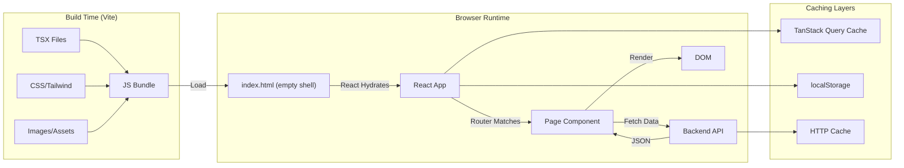
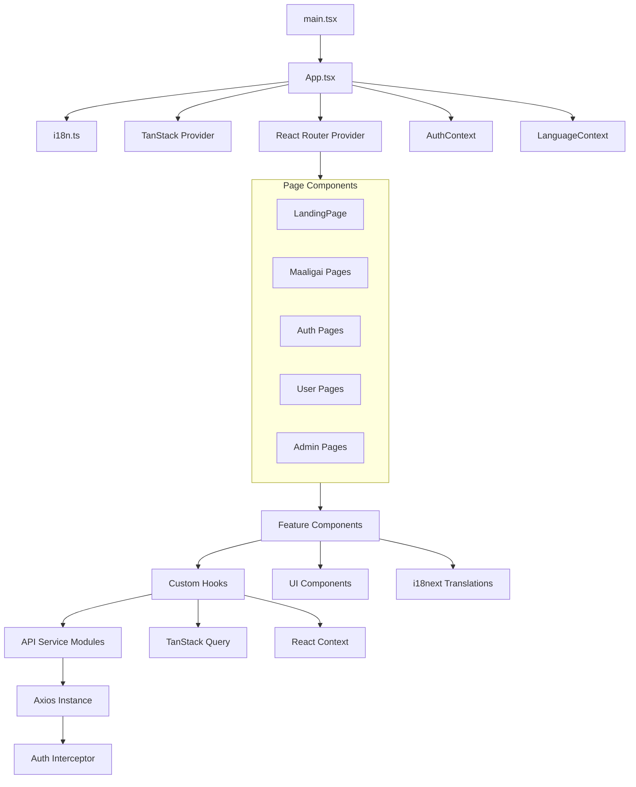

# Frontend Architecture

## Rendering Model: Single Page Application (CSR-only)

This app uses **Client-Side Rendering (CSR)** exclusively — no SSR, no SSG, no ISR.



### Implications of CSR-only

| Aspect | Impact | Mitigation |
|---|---|---|
| **SEO** | Crawlers see empty HTML | MetadataManager for social tags; Google can index SPAs |
| **Initial Load** | Blank screen until JS loads | Code splitting + lazy loading |
| **Performance** | All rendering on client | Memoization, virtualization for lists |
| **Simplicity** | No server rendering complexity | Faster development, no hydration mismatch |
| **Hosting** | Static file serving only | Vercel SPA rewrite config |

## Build Pipeline

```mermaid
flowchart TD
    SRC["src/"] --> Vite[Vite Dev Server]
    TSX --> ESBuild["ESBuild (TS→JS)"]
    CSS --> PostCSS["PostCSS + Tailwind v4"]
    Assets --> Vite
    
    Vite -->|Dev| HMR["Hot Module Replacement"]
    Vite -->|Build| Rollup["Rollup Production Build"]
    Rollup --> Chunks["Code-Split Chunks"]
    Chunks --> Dist["dist/"]
    Dist --> VercelDep["Vercel Deploy"]
    
    subgraph Optimization["Production Optimizations"]
        Treeshaking
        Minification
        CSS inlining
        Asset hashing
        Dynamic imports
    end
    
    Rollup --> Optimization
```

## Module Dependency Graph



## Code Organization Rules

```
src/
├── api/            # API service modules (one per domain)
├── components/
│   ├── animations/ # Animation components
│   ├── features/   # Domain-specific feature components
│   │   ├── admin/  # Admin feature components
│   │   ├── auth/   # Auth feature components
│   │   ├── landing/
│   │   ├── maaligai/
│   │   ├── matrimony/
│   │   └── user/
│   ├── forms/      # Form components (one per form)
│   ├── modals/     # Modal components (one per modal)
│   └── ui/         # Shared UI primitives
│       ├── atoms/
│       ├── cards/
│       ├── feedback/
│       ├── forms/  # 22 reusable form controls
│       ├── layout/
│       └── table/
├── config/         # App configuration
├── context/        # React contexts
├── hooks/          # Custom hooks
│   ├── auth/
│   └── queries/
├── layout/         # Layout components per domain
│   ├── admin/
│   ├── auth/
│   ├── landing/
│   ├── maaligai/
│   └── user/
├── lib/            # Library config (Axios)
├── locales/        # i18n translations
│   ├── en/         # 24 English namespaces
│   └── ta/         # 24 Tamil namespaces
├── pages/          # Route page components
├── types/          # TypeScript type definitions
└── utils/          # Utility functions
```

## Architectural Boundaries — What Belongs Where

| Concern | Must Go In | Must NOT Go In |
|---|---|---|
| API calls | `api/*.api.ts` | Components, hooks directly |
| Server state | TanStack Query hooks (`hooks/queries/`) | Component `useState` |
| UI state | Component `useState` / `useReducer` | Global context |
| Global auth state | `AuthContext` | localStorage reads in components |
| Language state | `LanguageContext` | Individual component state |
| Form state | Form component state | Global state (unless shared wizard) |
| Business logic | Backend services | Frontend components |
| UI logic | Hooks / utilities | Page components |
| Animations | Framer Motion wrappers | Inline in every component |
| Translations | i18next namespace files | Hardcoded strings |

## Optimization Rules

- ❌ Do NOT use `useState` for data fetched from API — use TanStack Query
- ❌ Do NOT create `useEffect` for data fetching — use TanStack Query
- ❌ Do NOT import from `@/components/ui/` directly in pages — go through feature components
- ❌ Do NOT put API URLs in components — use `VITE_API_URL` env var
- ❌ Do NOT bypass the Axios instance — raw `fetch()` loses interceptors
- ❌ Do NOT store `user` or `token` in React state directly — use `AuthContext`
- ❌ Do NOT add new npm packages without checking if existing ones can do the job
