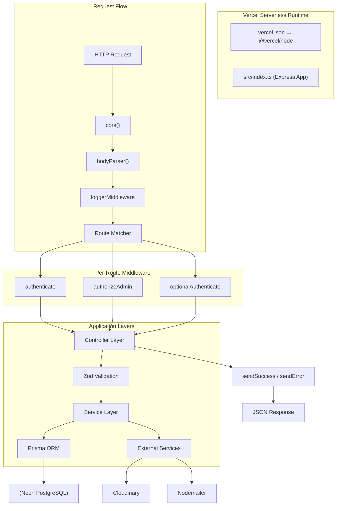
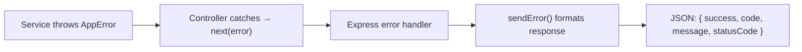

# Backend Architecture

## Express 5 Serverless Architecture

The backend runs as a **Vercel serverless function** — a single Express 5 app exported as a handler.



## Express App Setup (`src/index.ts`)

```typescript
// Core setup pattern:
const app = express()
app.use(cors({ /* whitelist */ }))
app.use(bodyParser.urlencoded({ extended: false }))
app.use(loggerMiddleware)

// Route mounting — all under /api
app.use('/api/auth', authRoutes)
app.use('/api/profiles', profileRoutes)
app.use('/api/uploads', uploadRoutes)
// ... etc

// Health check
app.get('/health', (req, res) => { ... })

// Vercel export
export default app
```

## Cold Start Strategy

Serverless functions spin down after inactivity. Mitigations:

| Strategy | Implementation |
|---|---|
| **Prisma Client singleton** | `config/prisma.ts` — prevents multiple connections on warm starts |
| **Keep-alive requests** | Future: cron-ping `/health` every 5 minutes |
| **Minimal dependencies** | Only what's needed — reduces cold start bundle |
| **Lazy initialization** | Heavy imports (astrology engine) loaded on-demand |

## Controller Pattern

```typescript
// src/controllers/profile.ts
export const getBrowseProfiles: RequestHandler = async (req, res, next) => {
    try {
        const result = await profileService.getBrowseProfiles(req.query, req.user?.id)
        sendSuccess(res, 200, 'Profiles fetched', result)
    } catch (error) {
        next(error)
    }
}
```

**Rules:**
- Controllers are **thin** — parse input, call service, send response
- Controllers do NOT contain business logic
- Controllers do NOT call Prisma directly
- Errors are forwarded to centralized error handler via `next(error)`

## Service Pattern

```typescript
// src/services/profile.ts
export const profileService = {
    async getBrowseProfiles(filters: BrowseFilters, userId?: string) {
        // 1. Business logic / validation
        // 2. Prisma query building
        // 3. Data transformation
        // 4. Return result
    }
}
```

**Rules:**
- Services contain ALL business logic
- Services handle transactions via Prisma
- Services call external services (Cloudinary, email)
- Services throw `AppError` for known failure cases
- Services do NOT access `req` / `res`

## Route Pattern

```typescript
// src/routes/profile.ts
const router = Router()

router.get('/browse', optionalAuthenticate, profileController.getBrowseProfiles)
router.get('/my', authenticate, profileController.getMyProfiles)
router.get('/:id', optionalAuthenticate, profileController.getProfileById)
router.post('/', authenticate, profileController.createProfile)

export default router
```

**Rules:**
- Routes only map HTTP verbs + paths to controllers
- Auth middleware applied per-route (not globally)
- Public routes use `optionalAuthenticate` when user context is optional

## Error Propagation Chain



## Anti-Patterns

- ❌ Do NOT use `req`/`res` in services — breaks testability
- ❌ Do NOT put raw SQL in controllers — use Prisma in services
- ❌ Do NOT catch errors in controllers just to log — let the error handler do it
- ❌ Do NOT return 200 for errors — use proper HTTP status codes
- ❌ Do NOT expose stack traces in production — `NODE_ENV` check in error handler
- ❌ Do NOT import services directly in routes — go through controllers
- ❌ Do NOT create circular dependencies between services
