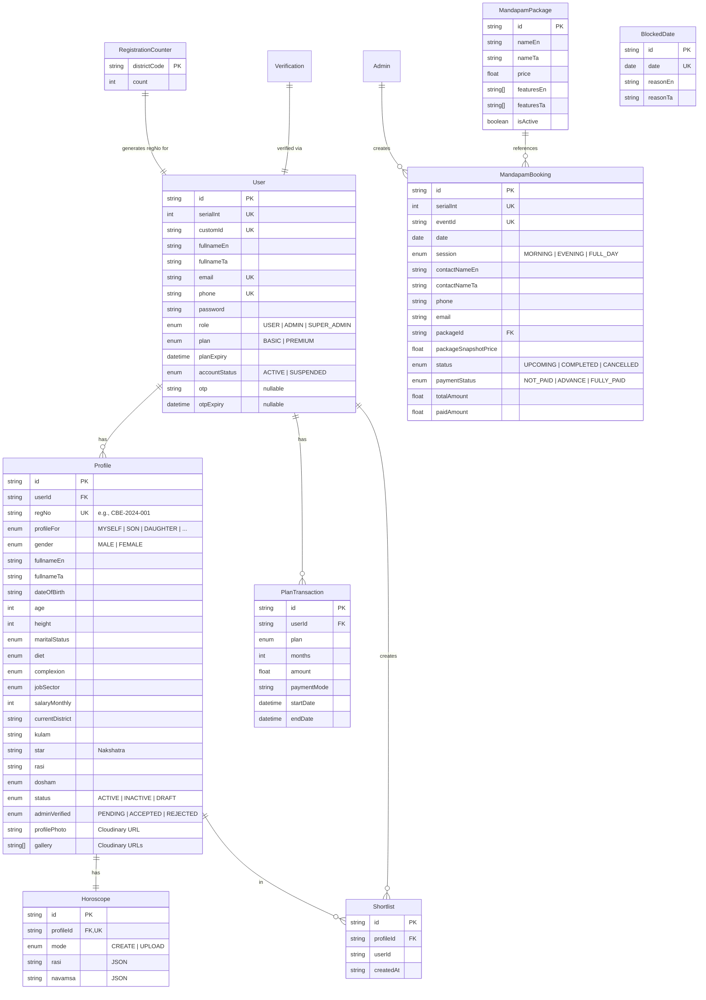

# Database Architecture

## Entity-Relationship Diagram



## Key Relationship Details

| Relationship | Type | Constraint |
|---|---|---|
| User → Profile | 1:N | `userId` FK, cascade on delete |
| Profile → Horoscope | 1:1 | `profileId` FK, unique, cascade on delete |
| Profile → Shortlist | 1:N | `profileId` FK, cascade on delete |
| User → Shortlist | 1:N | `userId` (no FK constraint — cross-model) |
| Admin → MandapamBooking | 1:N | `createdBy` FK to Admin |
| MandapamPackage → MandapamBooking | 1:N | `packageId` FK, `setNull` on delete |
| MandapamBooking → BlockedDate | 0:1 | Business logic (not FK) — date overlap check |

## Enum Design

**18 enums** model domain concepts as database types:

| Enum | Values | Used By |
|---|---|---|
| `Gender` | MALE, FEMALE | Profile filtering |
| `MaritalStatus` | NEVER_MARRIED, DIVORCED, WIDOWED | Profile filtering |
| `Dosham` | NO, CHEVVAI, NAGA, KALA_SARPA, RAHU_KETHU, OTHERS | Astrology matching |
| `Kulam` | KONGU_VELLALAR, KANGANI, etc. (60+) | Community filtering |
| `District` | All 38 TN districts + OTHER | Location filtering |
| `AccountPlan` | BASIC, PREMIUM | Feature gating |
| `AccountRole` | USER, ADMIN, SUPER_ADMIN | RBAC |
| `VerificationStatus` | PENDING, ACCEPTED, REJECTED | Profile lifecycle |
| `MandapamSession` | MORNING, EVENING, FULL_DAY | Booking slots |
| `MandapamPaymentStatus` | NOT_PAID, ADVANCE, FULLY_PAID | Payment tracking |

## Prisma Client Singleton

```typescript
// backend/src/config/prisma.ts
const globalForPrisma = globalThis as unknown as { prisma: PrismaClient }
export const prisma = globalForPrisma.prisma ?? new PrismaClient({ log: ['error'] })
if (process.env.NODE_ENV !== 'production') globalForPrisma.prisma = prisma
```

**Why**: Prevents connection pool exhaustion during hot-reload in development. The global cache survives module reloads.

## Normalization Strategy

- **3NF** for core entities: User, Profile, Horoscope, Shortlist
- **Snapshot denormalization** on MandapamBooking: `packageNameEn/Ta`, `packageSnapshotPrice` — preserves historical data if packages change
- **Enum columns** rather than lookup tables for small, stable lists (gender, diet, etc.)
- **Dual-field pattern** (`fieldEn`/`fieldTa`) for all user-facing text — meets bilingual requirement
- **JSON columns** for complex data: `Horoscope.rasi` + `navamsa` (structured astrology data)

## What NOT To Do

- ❌ Do NOT remove snapshot fields — they protect historical booking integrity
- ❌ Do NOT convert enums to lookup tables until values exceed ~100
- ❌ Do NOT add FKs on `Shortlist.userId` (it references User but through business logic, not constraint)
- ❌ Do NOT store sensitive data (plaintext passwords, raw OTPs) — always hash
- ❌ Do NOT use composite primary keys — Prisma works best with UUID `id` fields
- ❌ Do NOT cascade delete from User to Profile without confirming shortlist cleanup
