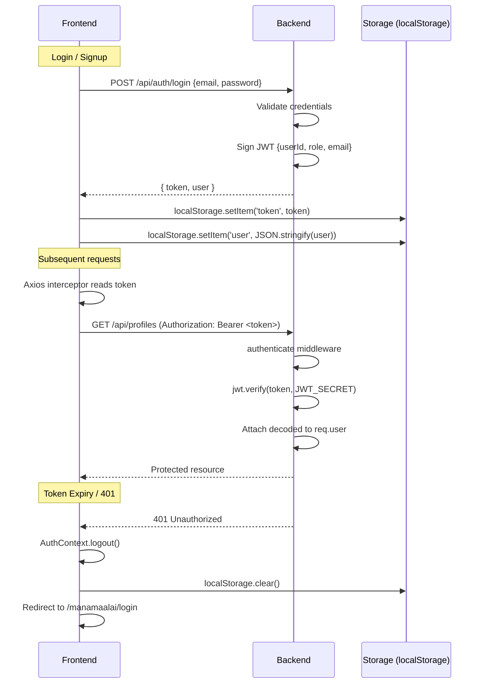
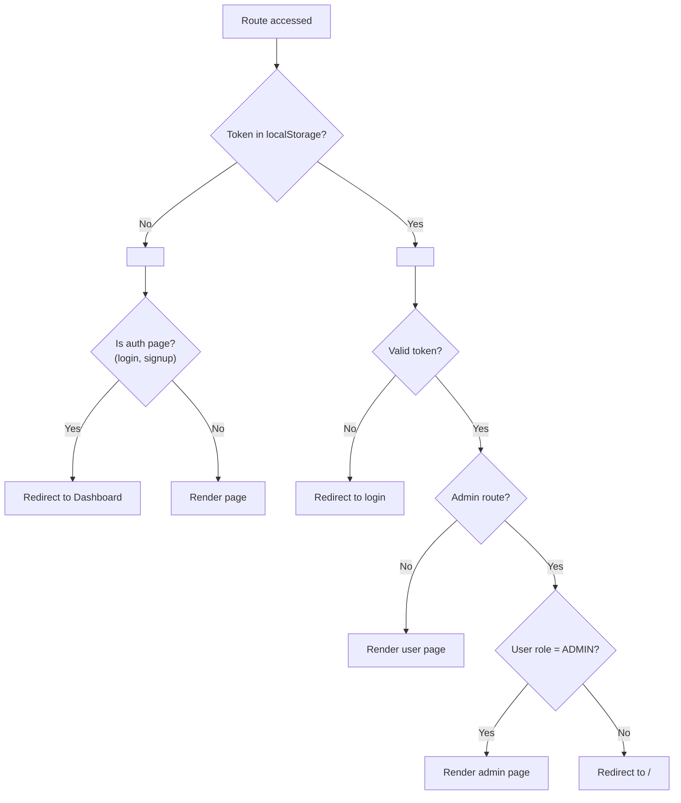
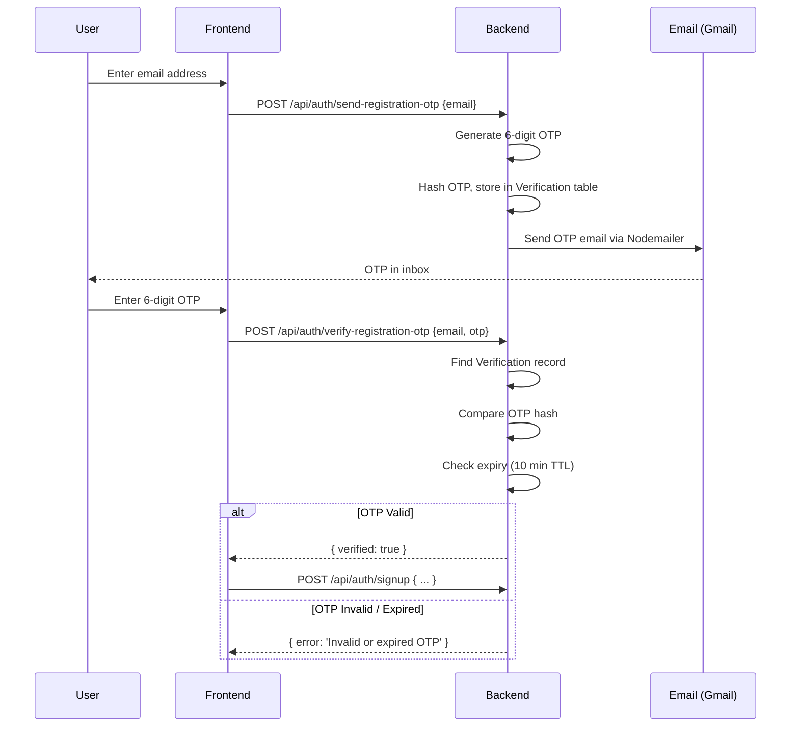

# Authentication Architecture

## Dual Auth Paths

```mermaid
flowchart TD
    subgraph UserAuth["User Authentication"]
        UL["/manamaalai/login"] --> ULogin["AuthService.login()"]
        ULogin --> UCheck{Email exists?}
        UCheck -->|No| UError["401 Invalid credentials"]
        UCheck -->|Yes| UPW["Compare bcrypt hash"]
        UPW -->|Mismatch| UError
        UPW -->|Match| UJWT["Generate JWT (7d)"]
        UJWT --> UResp["Return {token, user, role: USER}"]
    end
    
    subgraph AdminAuth["Admin Authentication"]
        AL["/admin/login"] --> ALogin["AuthService.adminLogin()"]
        ALogin --> ACheck{Email exists?}
        ACheck -->|No| AError["401 Invalid credentials"]
        ACheck -->|Yes| APW["Compare bcrypt hash"]
        APW -->|Mismatch| AError
        APW -->|Match| AJWT["Generate JWT (7d)"]
        AJWT --> AResp["Return {token, admin, role: ADMIN}"]
    end
    
    subgraph Registration["Registration Flow"]
        S["/manamaalai/signup"] --> SOtp["Send Registration OTP"]
        SOtp --> V["/api/auth/send-registration-otp"]
        V --> Email["Nodemailer → Gmail SMTP"]
        Email --> VF["Verify OTP"]
        VF --> SV["/api/auth/verify-registration-otp"]
        SV --> VR["/api/auth/signup"]
        VR --> Create["Create User + Generate regNo"]
    end
```



## JWT Token Lifecycle



## Auth Middleware Chain

```typescript
// backend/src/middlewares/auth.ts

// 1. authenticate — REQUIRED auth
export const authenticate: RequestHandler = async (req, res, next) => {
    const token = req.headers.authorization?.replace('Bearer ', '')
    if (!token) return sendError(res, 401, ErrorCode.UNAUTHORIZED)
    
    try {
        const decoded = jwt.verify(token, process.env.JWT_SECRET!) as JwtPayload
        req.user = decoded
        next()
    } catch {
        sendError(res, 401, ErrorCode.INVALID_TOKEN)
    }
}

// 2. authorizeAdmin — ADMIN-only
export const authorizeAdmin: RequestHandler = (req, res, next) => {
    if (req.user?.role !== 'ADMIN' && req.user?.role !== 'SUPER_ADMIN') {
        return sendError(res, 403, ErrorCode.FORBIDDEN)
    }
    next()
}

// 3. optionalAuthenticate — optional auth (populates req.user if token present)
export const optionalAuthenticate: RequestHandler = async (req, res, next) => {
    const token = req.headers.authorization?.replace('Bearer ', '')
    if (token) {
        try {
            const decoded = jwt.verify(token, process.env.JWT_SECRET!) as JwtPayload
            req.user = decoded
        } catch { /* continue without auth */ }
    }
    next()
}
```

## RBAC Matrix

| Route Pattern | Middleware | Access |
|---|---|---|
| `/api/auth/*` | None | Public |
| `/api/profiles` (GET browse) | `optionalAuthenticate` | All (extras for authed) |
| `/api/profiles` (POST) | `authenticate` | USER only |
| `/api/profiles/:id` (PATCH) | `authenticate` | OWNER only |
| `/api/profiles/:id/status` (PATCH) | `authenticate` + `authorizeAdmin` | ADMIN only |
| `/api/admin/*` | `authenticate` + `authorizeAdmin` | ADMIN/SUPER_ADMIN only |
| `/api/shortlist/*` | `authenticate` | USER only |
| `/api/settings/change-password` | `authenticate` | USER/ADMIN |

## Frontend Route Protection



## OTP Flow



## Security Considerations

| Concern | Mitigation |
|---|---|
| Token theft (XSS) | Input sanitization, CSP headers |
| Token in URL | Never pass JWT in query params — Authorization header only |
| Password brute force | bcryptjs cost factor 10+, rate limiting |
| OTP interception | OTP sent to registered email only; 10-min TTL |
| Session fixation | New JWT on every login; no session reuse |
| Admin escalation | `authorizeAdmin` middleware on all admin routes |
| Token revocation | No blacklist (stateless JWT) — plan: Redis blacklist for future |

## What NOT To Do

- ❌ Do NOT store JWT in cookies (CSRF vulnerable) — localStorage + Authorization header is the pattern
- ❌ Do NOT implement refresh tokens without understanding the security implications
- ❌ Do NOT expose user passwords in API responses
- ❌ Do NOT skip auth middleware on any route that handles user data
- ❌ Do NOT implement "remember me" without explicit security review
- ❌ Do NOT log JWT tokens or passwords in error logs
