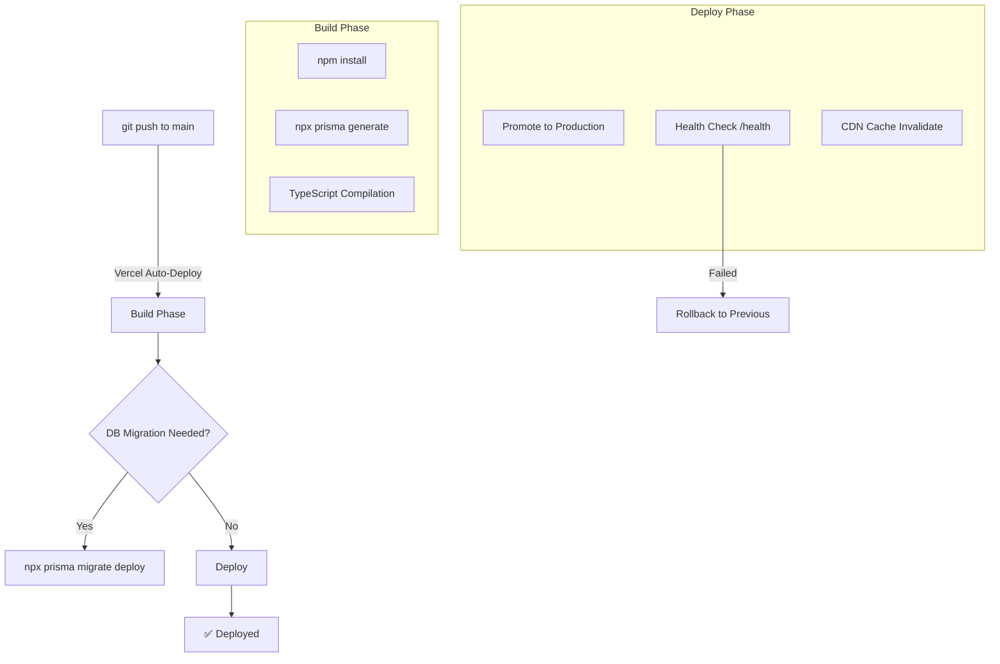

# Deployment Architecture

## Vercel Dual-Deployment

```mermaid
flowchart LR
    subgraph Git["GitHub Repository"]
        FrontendCode["frontend/"]
        BackendCode["backend/"]
    end
    
    subgraph Vercel["Vercel Projects"]
        subgraph FE["Frontend Project"]
            FEBuild["Vite Build (Rollup)"]
            FEDist["dist/ (static SPA)"]
            FERewrites["vercel.json SPA rewrites"]
            FECDN["Vercel Edge CDN"]
        end
        
        subgraph BE["Backend Project"]
            BEBuild["tsc compilation"]
            BEHandler["@vercel/node handler"]
            BELambda["Serverless Function"]
        end
    end
    
    subgraph Services["External Services"]
        Neon[(Neon PostgreSQL)]
        Cloudinary[Cloudinary]
        Gmail[Gmail SMTP]
    end
    
    Git --> Vercel
    
    Browser["Browser"] --> FECDN
    FECDN --> FERewrites
    FECDN -->|Routes to index.html|  FEDist
    
    FEDist -->|API calls| BELambda
    BELambda --> Neon
    BELambda --> Cloudinary
    BELambda --> Gmail
```

## Frontend Vercel Config

```json
// frontend/vercel.json
{
    "rewrites": [{ "source": "/(.*)", "destination": "/index.html" }]
}
```

**Why**: SPA routing — all paths serve `index.html` and React Router handles client-side navigation.

## Backend Vercel Config

```json
// backend/vercel.json
{
    "version": 2,
    "builds": [
        {
            "src": "src/index.ts",
            "use": "@vercel/node"
        }
    ],
    "routes": [
        { "src": "/api/(.*)", "dest": "src/index.ts" },
        { "src": "/health", "dest": "src/index.ts" }
    ]
}
```

**Why**: Every request to `/api/*` or `/health` triggers the Express serverless function.

## Environment Variable Mapping

| Env Var | Frontend | Backend | Description |
|---|---|---|---|
| `VITE_API_URL` | ✅ | ❌ | Backend API base URL (`/api`) |
| `DATABASE_URL` | ❌ | ✅ | Neon PostgreSQL connection string |
| `JWT_SECRET` | ❌ | ✅ | JWT signing secret |
| `CLOUDINARY_*` | ❌ | ✅ | Cloudinary credentials |
| `EMAIL_*` | ❌ | ✅ | Gmail SMTP credentials |
| `FRONTEND_URL` | ❌ | ✅ | CORS allowed origin |
| `NODE_ENV` | ❌ | ✅ | Environment mode |

## Deployment Flow



## Production Build Commands

```bash
# Frontend
cd frontend
npm run build          # Vite production build → dist/
# Output: dist/assets/* (code-split chunks + hashed filenames)

# Backend
cd backend
npx prisma generate    # Generate Prisma client
npm run build          # tsc → dist/
# Output: dist/src/index.js (serverless handler)
```

## Local Development Flow

```bash
# Terminal 1: Backend
cd backend
cp .env.example .env   # Configure DB + secrets
npm install
npx prisma generate
npx prisma db push     # Sync schema to local DB
npm run dev            # ts-node watch → localhost:5001

# Terminal 2: Frontend
cd frontend
cp .env.example .env   # Set VITE_API_URL=http://localhost:5001/api
npm install
npm run dev            # Vite HMR → localhost:5173
```

## Vercel Monitoring

| Tool | Purpose |
|---|---|
| Vercel Dashboard | Function invocations, errors, duration, cold starts |
| Vercel Analytics | Frontend page views, web vitals |
| Neon Console | DB connections, query performance, pool usage |
| Cloudinary Dashboard | Image transformations, bandwidth |

## Scaling Concerns

| Concern | Mitigation | Future |
|---|---|---|
| Serverless cold start | Keep-alive pings | Provisioned Concurrency (Vercel Pro) |
| DB connection limit (Neon) | Prisma connection pooling | Connection pooler (pgBouncer) |
| Serverless timeout (10s) | Optimize query times | Background jobs for heavy tasks |
| Build times | Code splitting, tree-shaking | Turborepo for monorepo caching |
| CDN cache miss | Cache-Control headers | Edge caching for static assets |

## What NOT To Do

- ❌ Do NOT commit `.env` files — they contain secrets
- ❌ Do NOT run `prisma migrate dev` in production — use `prisma migrate deploy`
- ❌ Do NOT use `npm run dev` in production — it starts ts-node, not compiled JS
- ❌ Do NOT assume Vercel serverless functions stay warm — design for cold starts
- ❌ Do NOT exceed 50MB serverless function bundle — split into multiple functions if needed
