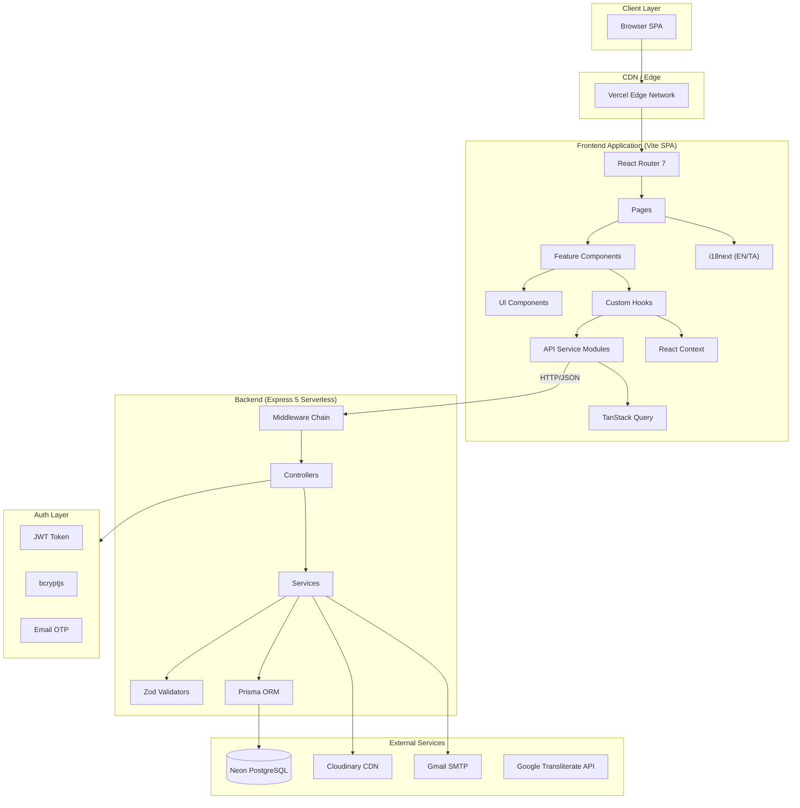
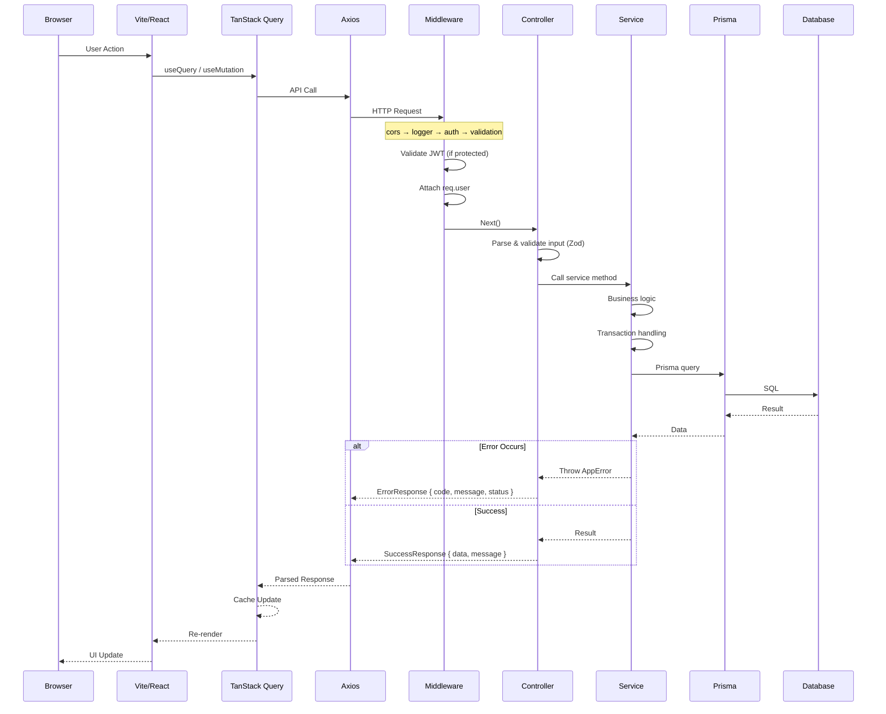

# System Architecture Overview

## Layered Architecture



## Request Lifecycle



## Where Each Concern Lives

| Concern | Location | Why |
|---|---|---|
| Input Validation | **Frontend**: form validation in components<br>**Backend**: Zod schemas in `validators/` | Defense in depth — frontend for UX, backend for security |
| Business Logic | **`src/services/`** | Controllers are thin; services contain all rules |
| DB Access | **`prisma.$queryRaw` / `prisma.model.findMany`** in services | Repository pattern through Prisma — never raw SQL in controllers |
| Auth Enforcement | **`middlewares/auth.ts`** + route-level guards | Centralized, never forgotten |
| Error Formatting | **`utils/errors.ts`** + `utils/response.ts` | Consistent API responses everywhere |
| File Upload | **`cloudinary.service.ts`** + signed upload from frontend | Server-side signature, client-side upload for performance |
| Translation | **`locales/{en,ta}/`** — i18next namespaces | Runtime language switching without page reload |
| Caching | **TanStack Query** (frontend) + Prisma (query cache) | No Redis yet — see scalability docs |

## Data Flow — Key Paths

### Matrimony Profile Flow
```
User fills form → ProfileService.createProfile()
  → Zod validation
  → Generate regNo (atomic district counter)
  → Create Profile with Horoscope
  → Upload photos (Cloudinary signed URL)
  → Set status=DRAFT / PENDING
  → Admin verifies → status=ACTIVE
  → Visible in browse results
```

### Mandapam Booking Flow
```
Admin creates booking → MandapamBookingService.createBooking()
  → Validate date+session uniqueness
  → Validate package exists & active
  → Create booking with snapshot pricing
  → Track payment status
  → Block calendar slot
```

### Authentication Flow
```
Login → AuthService.login()
  → Find user by email
  → Compare bcrypt hash
  → Generate JWT (7d expiry)
  → Return { token, user }
  → Frontend stores in localStorage
  → Axios interceptor attaches Authorization header
```

## Anti-Patterns & Rules

| Rule | Rationale |
|---|---|
| **Controllers must NOT contain business logic** | Testing becomes impossible; logic duplication |
| **Services must NOT call other services directly** | Use controller orchestration or event bus (future) |
| **Frontend must NOT bypass TanStack Query** | Manual fetch/state leads to cache inconsistency |
| **API modules must NOT contain URL strings** | All URLs in env vars or config constants |
| **Translations must NOT be hardcoded in components** | Always use `useTranslation()` or `t()` |
| **DB queries must NOT be in controllers** | Every query should be wrapped in a service method |
| **Auth checks must NOT rely on frontend alone** | Backend enforces all auth; frontend is UX-only |

## Debugging Considerations

- Use `loggerMiddleware` ANSI output to trace requests in real-time
- TanStack Query Devtools in dev mode for cache inspection
- Prisma's `log: ['query']` for SQL debugging (dev only)
- Check `VITE_API_URL` is correct for the environment
- Serverless cold starts cause initial latency on first request after idle
