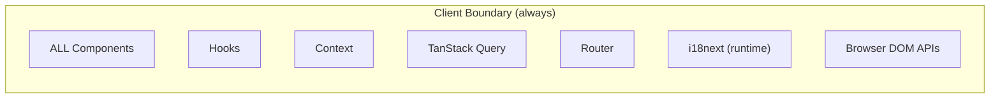
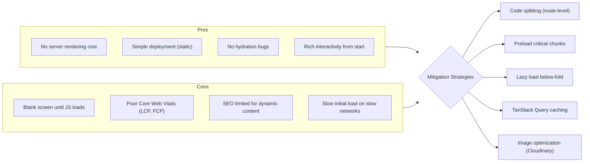
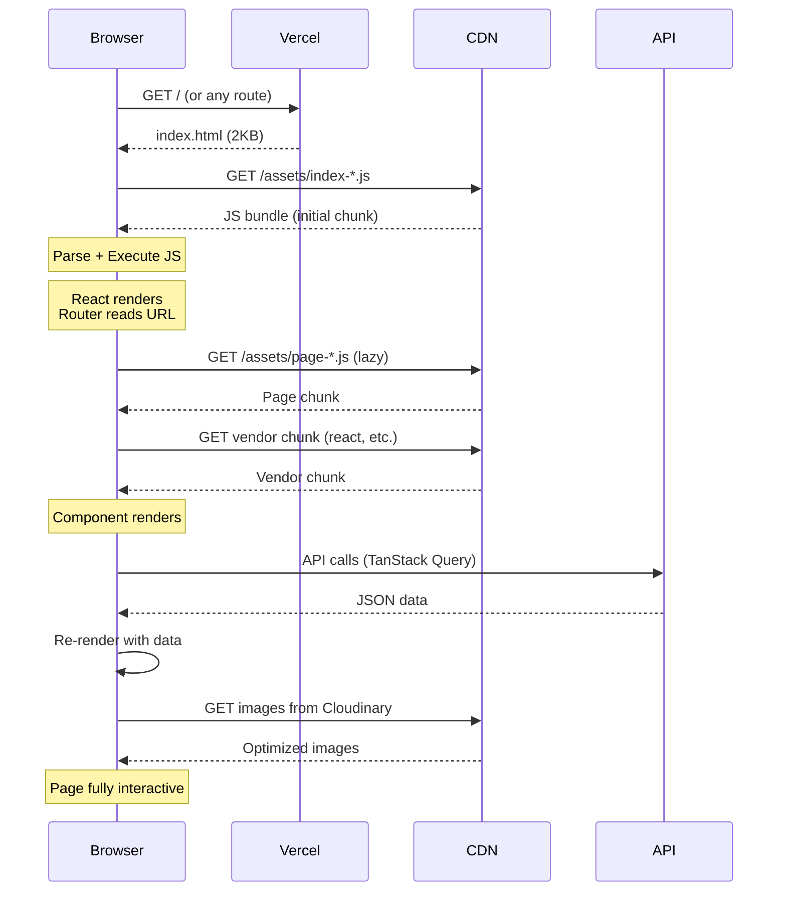

# Rendering Architecture

## Rendering Model: CSR-Only SPA

This application uses **exclusive Client-Side Rendering**. There is no SSR, SSG, or ISR.

```mermaid
flowchart TD
    subgraph InitialLoad["Initial Page Load"]
        URL["Browser requests URL"] --> HTML["Server returns index.html"]
        HTML --> Empty["<div id='root'></div> (empty)"]
        Empty --> Scripts["Load JS bundles"]
        Scripts --> React["React hydrates"]
        React --> Route["Router matches path"]
        Route --> Fetch["Fetch data (TanStack Query)"]
        Fetch --> Render["Render to DOM"]
    end
    
    subgraph Navigation["Subsequent Navigation (SPA)"]
        Click["Click <Link>"] --> Route2["Router intercepts"]
        Route2 --> Lazy["Lazy load page chunk"]
        Lazy --> Fetch2["Fetch data (cache hit? stale? refetch?)"]
        Fetch2 --> Render2["Render to DOM (no full reload)"]
    end
```



## Why CSR and Not SSR?

| Factor | CSR (Current) | SSR | Verdict |
|---|---|---|---|
| **Time to Interactive** | Slower (JS must load) | Faster (HTML is ready) | SSR wins |
| **SEO** | Needs extra work | Native | SSR wins |
| **Development speed** | Simple | Complex (hydration, server) | CSR wins |
| **Hosting cost** | Static files (cheap) | Server runtime | CSR wins |
| **Auth handling** | localStorage | Cookies (secure) | SSR wins |
| **Bilingual i18n** | Runtime switch | Server-rendered locale | CSR simpler |
| **Current team** | Vite SPA | Would need Next.js | CSR is current |

**Decision**: CSR is appropriate for this app's scale. SEO needs are minimal (logged-in user app). If SEO for public profile pages becomes a priority, migrate to Next.js with SSG for those pages.

## Hydration Strategy

Since this is CSR-only, there is **no SSR hydration**. React creates the DOM tree from scratch. This means:

- **No hydration mismatch bugs** (common in SSR apps)
- **Full JS required** to render anything — no progressive enhancement
- **Loading states** must be handled explicitly via spinners/skeletons

## Rendering Boundaries



Since there's no SSR, there are **no server/client component boundaries**. Every component is a client component. This simplifies the mental model but means no server-side data fetching.

## SEO Strategy

| Technique | Implementation | Status |
|---|---|---|
| **Meta tags** | `MetadataManager` component updates `<head>` | ✅ |
| **Social cards** | OpenGraph + Twitter card meta tags | ✅ |
| **Sitemap** | `sitemap.xml` for public pages | ❌ Future |
| **Server-side SEO** | SSR for public profile pages | ❌ Future |
| **JSON-LD** | Structured data for search engines | ❌ Future |

### MetadataManager Component

```typescript
// src/components/ui/layout/MetadataManager.tsx
// Called on route change to update:
// - document.title (from routeMetadata config)
// - meta[name=description]
// - meta[property=og:*]
// - meta[name=twitter:*]
// - link[rel=canonical]
```

## Performance Tradeoffs of CSR



## Loading Sequence



## What NOT To Do

- ❌ Do NOT implement SSR unless migrating to Next.js — partial SSR in Vite is fragile
- ❌ Do NOT use `next/dynamic` or Next.js-specific APIs — this is Vite, not Next
- ❌ Do NOT assume `window` is available at module scope — wrap in `useEffect` or guard
- ❌ Do NOT add SSR middleware to Vercel — the backend is a separate Express app
- ❌ Do NOT render large lists without virtualization (React Window)
- ❌ Do NOT put non-critical resources in the initial bundle — lazy load everything
