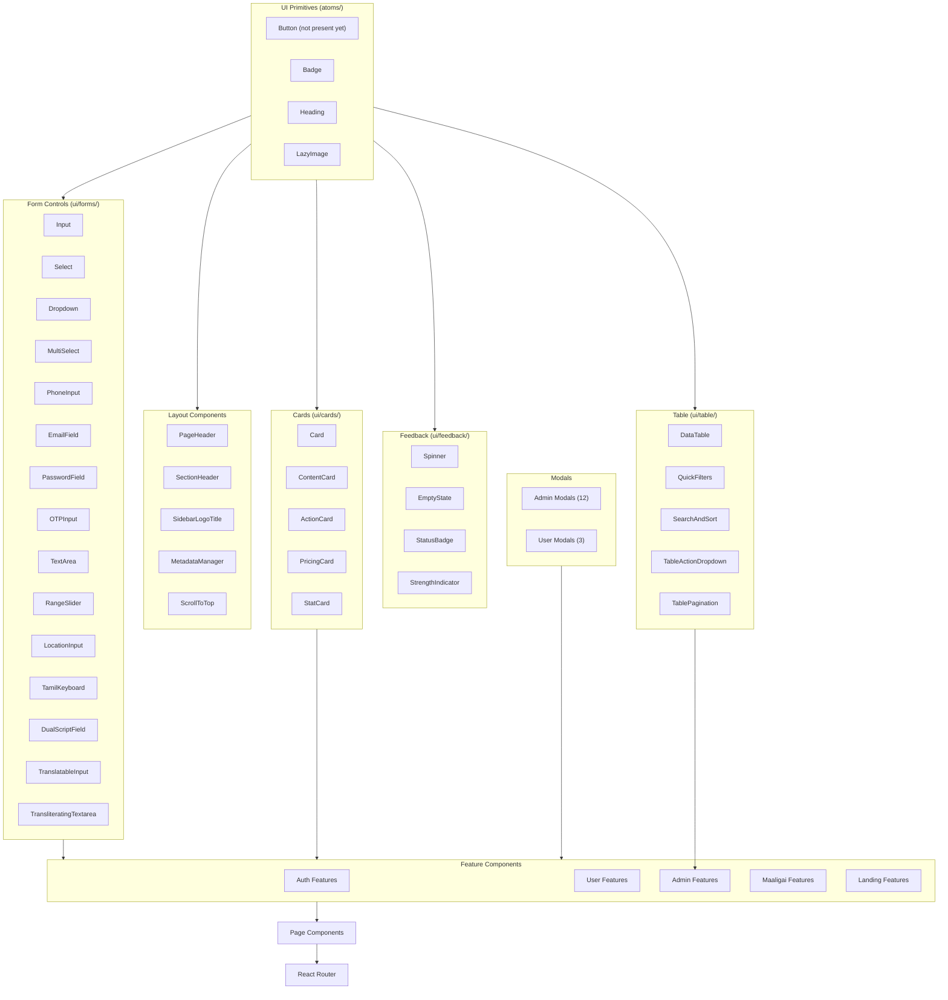
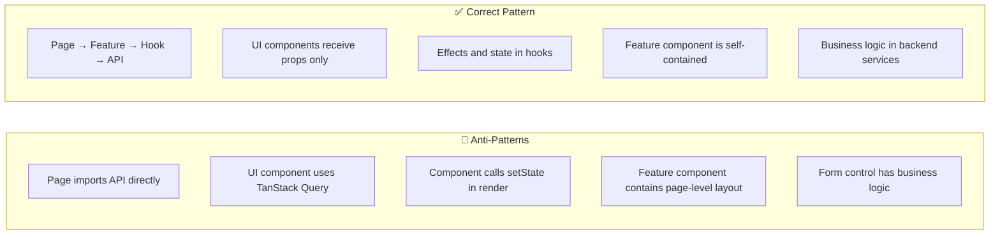

# Component Architecture

## Component Classification



## Smart vs Dumb Components

This app uses a **implicit smart/dumb pattern** (no formal container/presentational split, but the pattern exists):

| Type | Characteristics | Examples |
|---|---|---|
| **Smart** (connected) | Uses hooks, manages state, interacts with context, has side effects | `Dashboard.tsx`, `BrowseProfiles.tsx`, `ProfileManagement.tsx` |
| **Dumb** (presentational) | Receives props only, no direct dependencies, reusable | `Badge.tsx`, `Spinner.tsx`, `StatCard.tsx`, `TablePagination.tsx` |

### Rules

- **Feature components** (in `components/features/`) are smart — they own data fetching and state
- **UI components** (in `components/ui/`) are dumb — they receive props and render
- **Page components** (in `pages/`) are thin — they compose feature components and layouts
- **Modal components** are semi-smart — they emit actions but don't fetch data

## Component Dependency Direction

```
Pages → Feature Components → UI Components
                          → Hooks → API Modules
                          → Context
                          → Translations
```

Components must **never** import from a higher layer. A UI component must not import a feature component.

## Shared Component Patterns

### Card Pattern
```typescript
// ui/cards/Card.tsx — base
// ui/cards/PricingCard.tsx — extends Card for pricing
// features/admin/mandapam/packages/PackageCard.tsx — domain-specific pricing
```

### Form Control Pattern
```typescript
// ui/forms/Input.tsx — base input
// ui/forms/EmailField.tsx — wraps Input with email validation
// ui/forms/PhoneInput.tsx — wraps Input with phone formatting
// ui/forms/DualScriptField.tsx — wraps two inputs (EN/TA)
```

### Table Pattern
```typescript
// ui/table/DataTable.tsx — generic sortable/filterable table
// Admin components use DataTable + QuickFilters + SearchAndSort + TablePagination
```

## Anti-Patterns



## Component Rules

- ❌ Do NOT put API calls directly in component JSX — use custom hooks
- ❌ Do NOT put layout logic (header, sidebar) in feature components — use layout files
- ❌ Do NOT duplicate component logic across features — extract to shared hooks
- ❌ Do NOT use inline styles — use Tailwind classes
- ❌ Do NOT create new UI primitives without checking if existing ones suffice
- ❌ Do NOT use `any` type for props — always define interfaces
- ❌ Do NOT import from deep paths like `../../components/ui/Input` — use `@/` alias
