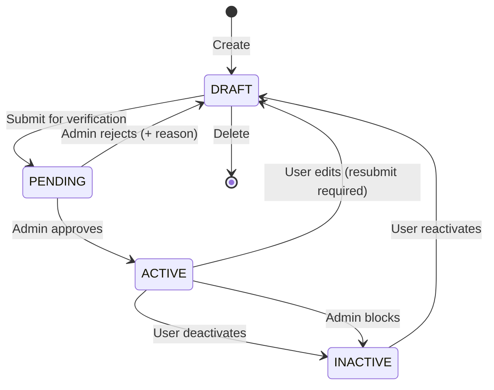
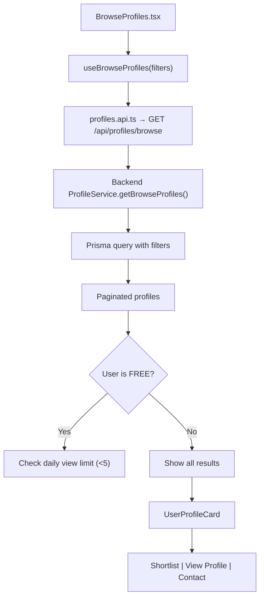
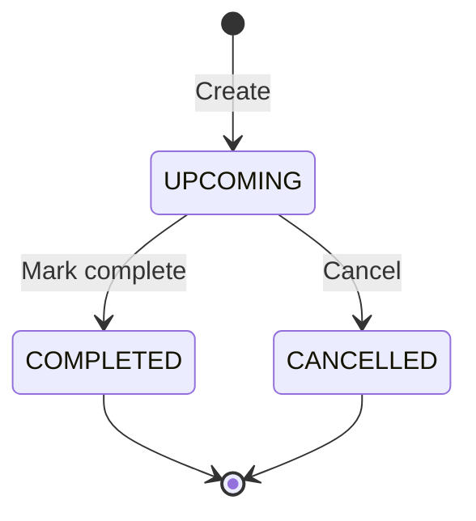
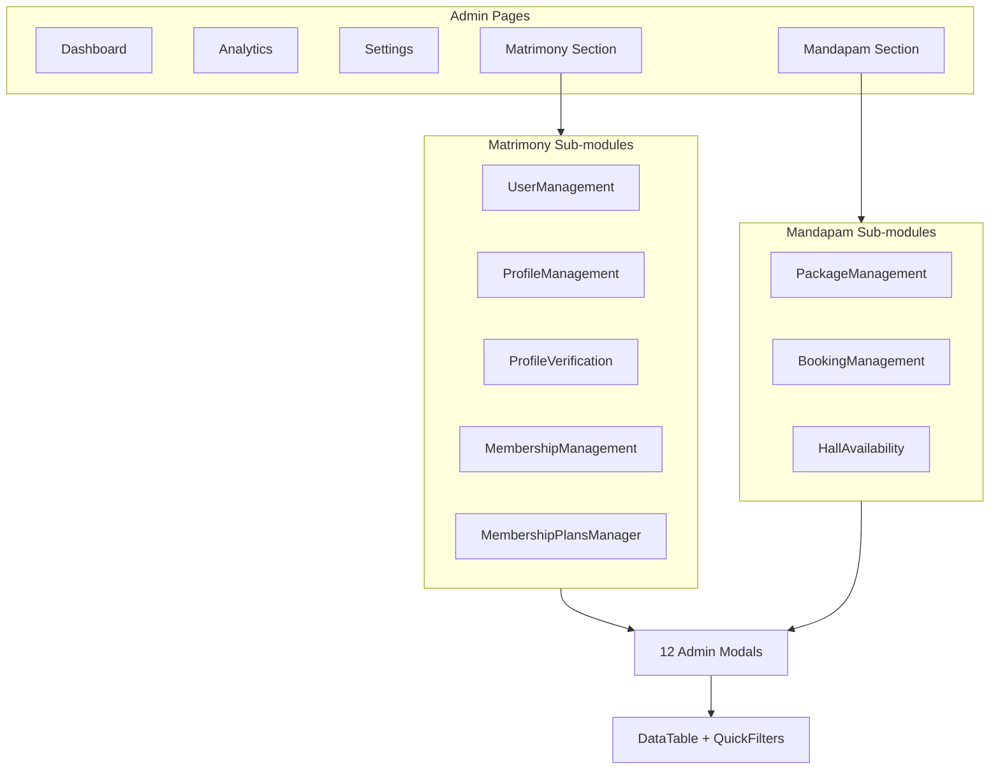

# Feature Module Documentation

## Auth Module

### Files
```
components/features/auth/
├── Login.tsx
├── Signup.tsx
├── AdminLogin.tsx
├── ForgotPassword.tsx
├── ProtectedRoute.tsx
└── PublicRoute.tsx

components/forms/auth/
├── AdminLoginForm.tsx
├── ForgotPasswordForm.tsx
├── LoginForm.tsx
└── SignupForm.tsx

hooks/auth/
└── useAuth.ts
```

### Auth Hooks Used
- `useAuth()` — TanStack Query mutations for login/signup/logout
- `useForm` (implicit) — form state management in form components

### API Endpoints
| Hook | Endpoint | Method |
|---|---|---|
| `useLogin` | `/api/auth/login` | POST |
| `useSignup` | `/api/auth/signup` | POST |
| `useAdminLogin` | `/api/auth/admin-login` | POST |
| `useForgotPassword` | `/api/auth/forgot-password` | POST |
| `useSendOtp` | `/api/auth/send-registration-otp` | POST |
| `useVerifyOtp` | `/api/auth/verify-registration-otp` | POST |

### State Flow
```
Form Input → useState → Form Validation → Auth Hook (useMutation)
  → API Call → Success → AuthContext.login(token, user) → Route Redirect
  → API Call → Error → Display Error Message
```

### Validation Rules
- Email: valid format, required
- Password: min 8 chars, mixed case + number
- Phone: 10-digit Indian format
- OTP: exactly 6 digits

---

## Profile Module

### Files
```
components/features/user/
├── NewProfile.tsx
├── MyProfiles.tsx
├── ProfileView.tsx
├── BrowseProfiles.tsx
├── UserProfileCard.tsx
├── PrintProfile.tsx
├── MyAccount.tsx
├── Dashboard.tsx
└── Shortlist.tsx

hooks/queries/
├── useProfiles.ts
├── useMyProfiles.ts
├── useBrowseProfiles.ts
├── useDashboard.ts
├── useShortlist.ts
└── useToggleShortlist.ts
```

### Profile Lifecycle



### Browse Profiles Flow



### Profile Form State

The NewProfile form is a **single-page wizard** (not multi-step) with sections:
1. Personal Details (name, DOB, gender, etc.)
2. Community (kulam, sub-caste)
3. Astrology (rasi, nakshatra, dosham)
4. Professional (education, job, salary)
5. Family (father, mother, siblings)
6. Expectations (partner preferences)
7. Photos (upload to Cloudinary)

All state is managed via `useProfileForm.ts` hook with `useReducer`.

---

## Dashboard Module

### Components
```
components/features/user/Dashboard.tsx
components/features/admin/Dashboard.tsx
```

### API Endpoints
| Hook | Endpoint | Purpose |
|---|---|---|
| `useDashboard` | `GET /api/dashboard/overview` | User stats (profile count, shortlist count, plan info) |
| `useAdminAnalytics` | `GET /api/admin/analytics` | Admin dashboard stats |

### User Dashboard State
```
AuthContext.user → User name, role, plan
useDashboard → Profile count, shortlist count, plan status
useMyProfiles → Recent profiles
```

---

## Booking Module (Mandapam)

### Files
```
components/features/admin/mandapam/
├── bookings/BookingManagement.tsx
├── bookings/BookingsFilter.tsx
├── bookings/BookingsTable.tsx
├── packages/PackageManagement.tsx
├── packages/PackageGrid.tsx
├── packages/PackageCard.tsx
├── availability/HallAvailability.tsx
└── ActionPanel.tsx

hooks/queries/useAdminMandapam.ts
```

### Booking Lifecycle



### API Endpoints (Admin)
| Purpose | Endpoint | Method |
|---|---|---|
| List bookings | `/api/admin/mandapam/bookings` | GET |
| Create booking | `/api/admin/mandapam/bookings` | POST |
| Update booking | `/api/admin/mandapam/bookings/:id` | PATCH |
| Delete booking | `/api/admin/mandapam/bookings/:id` | DELETE |
| Add payment | `/api/admin/mandapam/bookings/:id/payment` | POST |
| Calendar | `/api/admin/mandapam/calendar?month=&year=` | GET |
| Check availability | `/api/admin/mandapam/availability` | GET |
| Block date | `/api/admin/mandapam/block-date` | POST |

---

## Admin Module

### Files
```
components/features/admin/
├── Analytics.tsx
├── Dashboard.tsx
├── Settings.tsx
├── mandapam/... (above)
└── matrimony/
    ├── ProfileManagement.tsx
    ├── ProfileVerification.tsx
    ├── VerificationQueuePreview.tsx
    ├── ProfileView.tsx
    ├── UserManagement.tsx
    ├── MembershipManagement.tsx
    ├── MembershipPlansManager.tsx
    └── PrintProfile.tsx

hooks/queries/
├── useAdminMatrimony.ts
├── useAdminAnalytics.ts
└── useAdminMandapam.ts
```

### Admin Module Architecture



---

## Module Dependency Rules

- ❌ Do NOT import from a different feature module's components directly
- ❌ Do NOT share state between feature modules via props — use context or TanStack Query
- ❌ Do NOT put admin components in the user feature folder or vice versa
- ❌ Do NOT create circular dependencies between feature modules
- ✅ Extract shared logic to `hooks/` (not hooks/queries/) for cross-module reuse
- ✅ Use TanStack Query's `queryKey` for cross-module cache sharing
