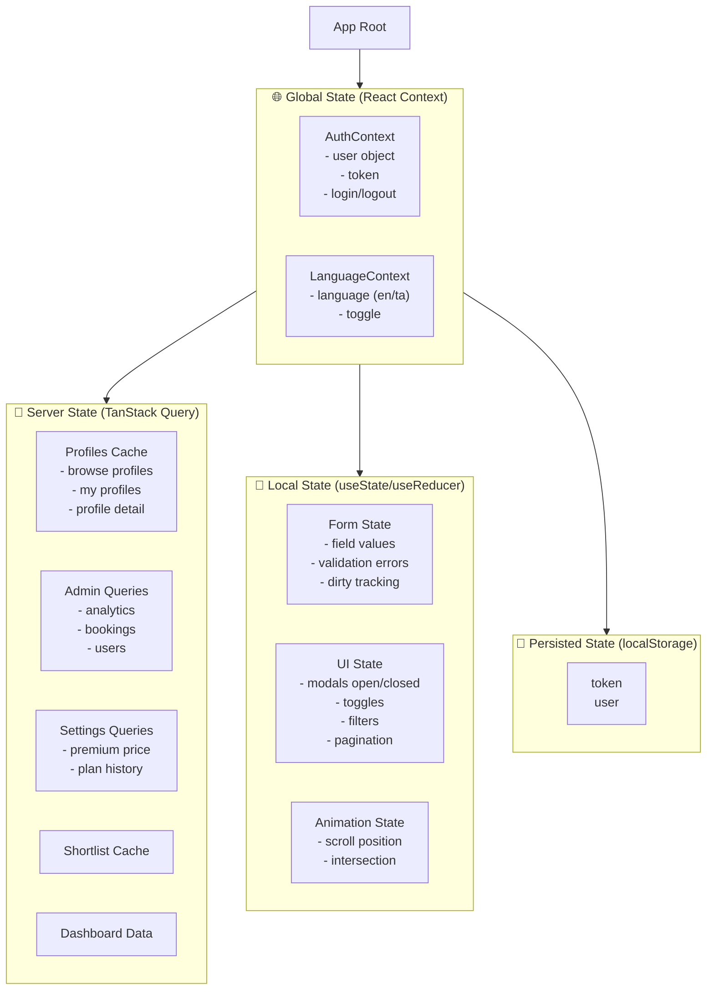
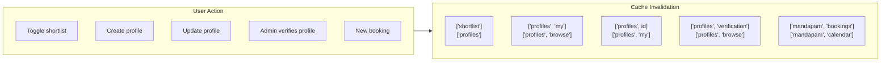
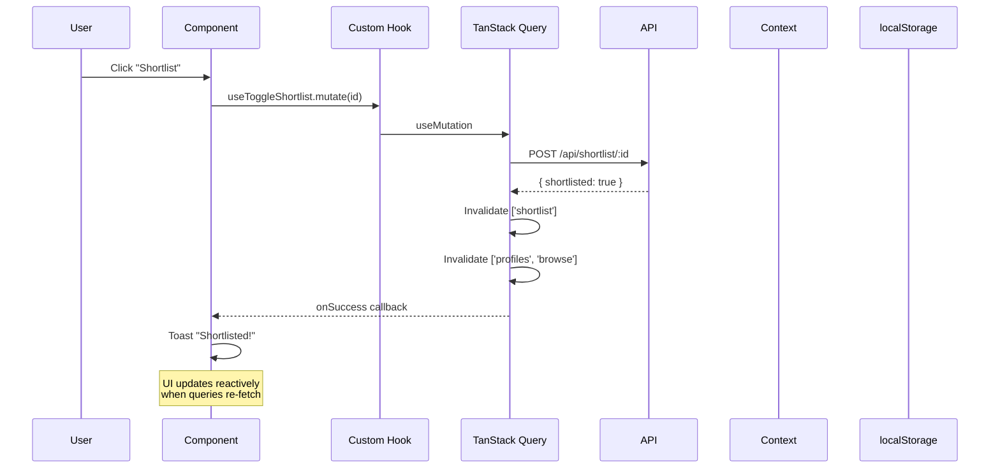

# State Management Architecture

## State Layers



## Global State: React Context

### AuthContext
```typescript
// context/AuthContext.tsx
interface AuthContextType {
    user: User | null
    token: string | null
    login: (token: string, user: User) => void
    logout: () => void
    isAuthenticated: boolean
    isAdmin: boolean
}
```
- **Persistence**: Token + user synced to localStorage on every change
- **Initial load**: Reads from localStorage on mount
- **Logout**: Clears localStorage, resets TanStack Query cache, redirects to login
- **Usage**: Accessed via `useAuth()` hook (not context directly)

### LanguageContext
```typescript
// context/LanguageContext.tsx
interface LanguageContextType {
    language: 'en' | 'ta'
    toggleLanguage: () => void
    setLanguage: (lang: 'en' | 'ta') => void
}
```
- **Persistence**: Language preference in localStorage
- **Integration**: Syncs with i18next `changeLanguage()`

## Server State: TanStack Query v5

### Query Client Configuration
```typescript
const queryClient = new QueryClient({
    defaultOptions: {
        queries: {
            staleTime: 5 * 60 * 1000,     // 5 min before refetch
            gcTime: 30 * 60 * 1000,         // 30 min in garbage collection
            refetchOnWindowFocus: false,    // No auto-refetch on tab switch
            retry: false,                   // Don't retry failed queries
        },
    },
})
```

### Query Pattern
```typescript
// hooks/queries/useProfiles.ts
export function useBrowseProfiles(filters: BrowseFilters) {
    return useQuery({
        queryKey: ['profiles', 'browse', filters],
        queryFn: () => profilesApi.getBrowseProfiles(filters),
        enabled: !!filters.gender, // Only fetch when gender filter is set
    })
}
```

### Mutation Pattern
```typescript
export function useToggleShortlist() {
    const queryClient = useQueryClient()
    
    return useMutation({
        mutationFn: (profileId: string) => shortlistApi.toggle(profileId),
        onSuccess: () => {
            // Invalidate both shortlist and profile caches
            queryClient.invalidateQueries({ queryKey: ['shortlist'] })
            queryClient.invalidateQueries({ queryKey: ['profiles'] })
        },
        onError: (error) => {
            toast.error(t('common:error.generic'))
        },
    })
}
```

### Cache Invalidation Strategy



### Cache Revalidation Rules

| Event | Cache Cleared | Rationale |
|---|---|---|
| Login/logout | All queries | Auth-dependent data may change |
| Profile create | `['profiles', 'my']` | My profiles list changed |
| Profile update | `['profiles', id]`, `['profiles', 'my']` | Stale data |
| Shortlist toggle | `['shortlist']`, `['profiles', 'browse']` | Shortlist status changed |
| Admin verification | `['profiles', 'verification']`, `['profiles', 'browse']` | Profile status changed |
| Booking create | `['mandapam', 'bookings']`, `['mandapam', 'calendar']` | Calendar changed |

## Local State Patterns

### Form State
- Managed by `useState`/`useReducer` in form components
- NOT stored in global state or TanStack Query
- Validation errors are local
- Form submission triggers mutations

### UI State
- Modal open/close → `useState<boolean>`
- Dropdown open → `useState<boolean>`
- Active tab → `useState<string>`
- Pagination page → `useState<number>`
- Search term → `useState<string>` (debounced)

## State Flow Diagram



## What NOT To Do

- ❌ Do NOT use TanStack Query for UI-only state (modal open, accordion state)
- ❌ Do NOT use Context for server data — that's what TanStack Query is for
- ❌ Do NOT store derived data in state — compute it from source data
- ❌ Do NOT read `localStorage` directly in components — always go through AuthContext
- ❌ Do NOT set `staleTime: Infinity` unless data truly never changes
- ❌ Do NOT use `useState` for API responses — you'll miss caching, deduplication, and background refetch
- ❌ Do NOT create a separate state management library (Zustand, Redux) unless existing patterns are insufficient
