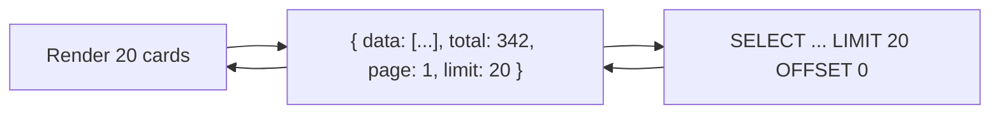

# Frontend Performance

## Bundle Optimization

### Current Bundle Structure
```
Vite Production Build → dist/
├── assets/
│   ├── index-{hash}.js       # Main entry (code-split)
│   ├── vendor-{hash}.js      # React, ReactDOM, React Router
│   ├── tanstack-{hash}.js    # TanStack Query
│   ├── i18n-{hash}.js        # i18next
│   ├── ui-{hash}.js          # MUI (limited usage)
│   └── page-*-{hash}.js      # Lazy-loaded page chunks
├── locales/                   # Split translation files
└── index.html
```

### Optimization Strategies Applied

| Strategy | Implementation | Impact |
|---|---|---|
| **Code splitting** | Vite dynamic imports per route | ~30% smaller initial bundle |
| **Tree shaking** | ES module imports, no side effects | Removes dead code |
| **Manual chunks** | Vite `manualChunks` config | Separates vendor code |

### Code Splitting — Route Level

```typescript
// App.tsx — pages are NOT lazy loaded currently
// FUTURE OPTIMIZATION:
const UserDashboard = lazy(() => import('@/pages/user/Dashboard'))
const BrowseProfiles = lazy(() => import('@/pages/user/BrowseProfiles'))
// ... etc
```

> **Note**: Route-level lazy loading is **not currently implemented**. All page components are eagerly loaded. This is a high-impact optimization opportunity.

## Rendering Optimization

### Memoization Strategy

| Technique | Where | When |
|---|---|---|
| `React.memo` | Expensive UI components (DataTable, large lists) | Props don't change often |
| `useMemo` | Computed values (filtered lists, sorted data) | Expensive calculations |
| `useCallback` | Event handlers passed to child components | Child is memoized |

### Current Usage
```typescript
// Good: useMemo for expensive computations
const filteredProfiles = useMemo(() => {
    return profiles.filter(p => matchesFilters(p, localFilters))
}, [profiles, localFilters])

// Good: useCallback for stable references
const handleShortlist = useCallback((id: string) => {
    toggleShortlist.mutate(id)
}, [toggleShortlist])
```

## Image Optimization

### Cloudinary Transformations

All images are served through Cloudinary with on-the-fly transformations:

| Parameter | Purpose | Example |
|---|---|---|
| `w_400,h_500,c_fill` | Profile photos — crop to fill | `/upload/w_400,h_500,c_fill/profile.jpg` |
| `q_auto` | Automatic quality | Optimal quality/size ratio |
| `f_auto` | Automatic format | WebP when supported |
| `dpr_auto` | Device pixel ratio | Sharp on retina displays |

### LazyImage Component

```typescript
// components/ui/atoms/LazyImage.tsx
// Uses IntersectionObserver to load images when they enter viewport
// Shows placeholder until loaded
// Handles error states gracefully
```

## API Optimization

### TanStack Query Deduplication

TanStack Query automatically deduplicates concurrent requests:

```
Component A → useQuery(['profiles', id])
Component B → useQuery(['profiles', id])
                         ↓
             Single API call (duplicate suppressed)
```

### Request Batching

Currently **no request batching** — every query is an independent API call. Future optimization: GraphQL or a custom batching endpoint for dashboard pages.

## Lazy Loading Audit

| Asset | Currently | Should Be |
|---|---|---|
| Page components | Eager | Lazy (route-level) |
| Translation namespaces | Eager (bundled) | Lazy (per-route) |
| MUI components | Eager | Lazy (only if used) |
| Recharts library | Eager (admin analytics) | Lazy (admin-only) |
| Astrology calculation | N/A (backend) | N/A |

## Virtualization

Large lists (browse profiles, admin tables) use **server-side pagination** (not client-side):



No client-side virtualization (React Window) is used yet. If profile lists exceed 100+ visible items, add virtualization.

## Performance Monitoring

| Metric | Current | Target |
|---|---|---|
| Lighthouse Performance | Not measured | >85 |
| First Contentful Paint | Not measured | <1.5s |
| Largest Contentful Paint | Not measured | <2.5s |
| Time to Interactive | Not measured | <3.5s |
| Bundle size (initial) | Not measured | <200KB gzipped |

## Optimization Priority List

| Priority | Optimization | Effort | Impact |
|---|---|---|---|
| 🔴 High | Route-level code splitting | 1 day | High (faster initial load) |
| 🔴 High | Add `width`/`height` to images | 0.5 day | Medium (reduce layout shift) |
| 🟡 Medium | Preload critical fonts | 0.5 day | Medium |
| 🟡 Medium | Add `loading="lazy"` to below-fold images | 0.5 day | Medium |
| 🟡 Medium | Memoize expensive list renders | 1 day | Medium |
| 🟢 Low | Implement virtualization for browse page | 2 days | High (if list > 100) |
| 🟢 Low | Add bundle analyzer to CI | 0.5 day | Low (monitoring) |
| 🟢 Low | Lazy load translation namespaces | 1 day | Medium |

## What NOT To Do

- ❌ Do NOT prematurely optimize — measure first, optimize second
- ❌ Do NOT add React Window unless lists exceed 100+ visible items
- ❌ Do NOT over-memoize — `useMemo`/`useCallback` on everything is anti-pattern
- ❌ Do NOT use `` without dimensions — causes Cumulative Layout Shift
- ❌ Do NOT bundle large libraries (MUI, Recharts) in the initial chunk — lazy load them
- ❌ Do NOT disable TanStack Query refetching for frequently-changing data
