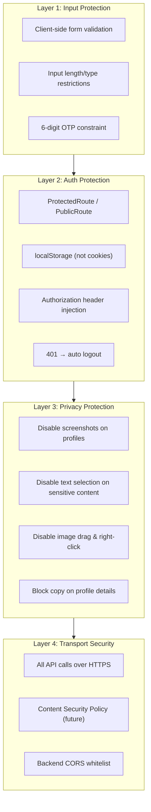

# Frontend Security

## Security Layers



## XSS Prevention

| Technique | Implementation | Status |
|---|---|---|
| React's built-in escaping | React auto-escapes JSX expressions | ✅ Automatic |
| Input sanitization | Zod validation on backend rejects malicious input | ✅ Backend |
| Output encoding | All user content rendered as text, not HTML | ✅ React default |
| CSP headers | Content-Security-Policy | ❌ Not implemented |
| Dangerous HTML | `dangerouslySetInnerHTML` | ✅ Never used |

## Auth Protection

### Token Storage
```typescript
// 🔴 NEVER do this:
// document.cookie = `token=${jwt}` (CSRF vulnerable)

// ✅ Current approach:
localStorage.setItem('token', token)
// Axios interceptor reads from localStorage on every request
```

### Route Protection

```typescript
// ProtectedRoute.tsx
<Route element={<ProtectedRoute />}>
    <Route path="/manamaalai/dashboard" element={<Dashboard />} />
    <Route path="/manamaalai/browse-profiles" element={<BrowseProfiles />} />
</Route>

// ProtectedRoute checks:
// 1. Token exists in localStorage
// 2. (Future) Token is not expired
// 3. (Admin routes) User role is ADMIN
```

### Axios Interceptor
```typescript
// lib/api.ts
api.interceptors.request.use((config) => {
    const token = localStorage.getItem('token')
    if (token) {
        config.headers.Authorization = `Bearer ${token}`
    }
    return config
})

api.interceptors.response.use(
    (response) => response,
    (error) => {
        if (error.response?.status === 401) {
            // Auto-logout: clear state, redirect to login
            queryClient.clear()
            localStorage.clear()
            window.location.href = '/manamaalai/login'
        }
        return Promise.reject(error)
    }
)
```

## Privacy Protections

### Screenshot Detection
```typescript
// utils/screenshotDetection.ts
// Detects PrintScreen key, DevTools open, and context menu
// Overlays a warning/watermark on profile images
```

### Content Protection
```typescript
// Applied to profile detail pages:
// - user-select: none (CSS)
// - -webkit-user-drag: none (images)
// - oncontextmenu="return false"
// - oncopy="return false" (on sensitive elements)
```

## Form Security

| Concern | Mitigation |
|---|---|
| Password autofill | `autoComplete="off"` on all forms |
| Password visibility | Toggle button (not plaintext by default) |
| OTP brute force | 6-digit OTP, 10-min expiry, rate-limited |
| Form spam | Backend rate limiting (future: CAPTCHA) |
| CSRF | No cookie-based auth (token in header) |

## Secure Token Handling Rules

- ✅ Token goes in `Authorization: Bearer <token>` header
- ✅ Token stored in `localStorage` (acceptable for SPA without SSR)
- ✅ 401 interceptor handles expiration gracefully
- ❌ Do NOT store token in URL query params
- ❌ Do NOT log token values
- ❌ Do NOT expose token in API responses beyond login
- ❌ Do NOT store token in Redux/Zustand (persistence issue)
- ❌ Do NOT use `document.cookie` for JWT storage (CSRF)

## Future Security Improvements

| Priority | Improvement | Reason |
|---|---|---|
| High | CSP headers | Prevent XSS, data injection |
| High | Rate limiting on auth endpoints | Prevent brute force |
| Medium | HTTP-only cookie + CSRF token | More secure than localStorage |
| Medium | CAPTCHA on signup | Prevent bot registration |
| Low | Security headers audit | HSTS, X-Frame-Options, etc. |
| Low | Dependency vulnerability scanning | npm audit in CI |

## What NOT To Do

- ❌ Do NOT disable security features for convenience
- ❌ Do NOT remove screenshot/right-click protection without product owner approval
- ❌ Do NOT add `dangerouslySetInnerHTML` anywhere in the codebase
- ❌ Do NOT skip route protection on admin pages
- ❌ Do NOT expose internal IDs in URLs that could be enumerated
- ❌ Do NOT trust frontend validation alone — always validate on backend
