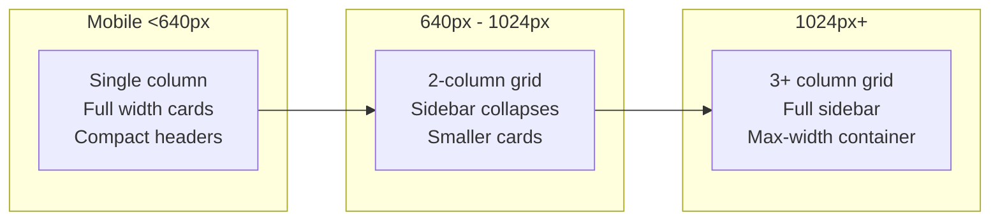

# UI/UX Design System

## Design Foundation

The design system is defined in two places:
1. **Tailwind CSS v4** — utility classes, theme tokens (in `assets/styles/index.css`)
2. **UI-SPEC.md** — Phase-specific design contracts (in project root)

## Color Palette

| Token | Hex | Usage |
|---|---|---|
| `--color-rosewood` | `#65000B` | Primary brand color, headers, key accents |
| `--color-gold` | `#C5A55A` | Secondary accent, highlights, badges |
| `--color-ivory` | `#FFFFF0` | Backgrounds, cards |
| `--color-cream` | `#FFFDD0` | Warm background variant |
| `--color-charcoal` | `#333333` | Body text |
| `--color-error` | `#DC2626` | Error states |
| `--color-success` | `#16A34A` | Success states |
| `--color-warning` | `#D97706` | Warning states |

## Typography

| Token | Font | Usage |
|---|---|---|
| Primary (en) | System sans-serif | Body text, labels |
| Tamil (ta) | System sans-serif | Tamil text (pulled from i18n) |
| Display | Serif (optional) | Headings, hero text |

### Scale
```
text-xs: 12px   — captions, metadata
text-sm: 14px   — labels, secondary text
text-base: 16px — body text
text-lg: 18px   — section headers
text-xl: 20px   — page headers
text-2xl: 24px  — hero headings
```

## Spacing System

Based on Tailwind v4 spacing scale (4px increments):

| Class | Value | Usage |
|---|---|---|
| `p-2` | 8px | Tight padding |
| `p-4` | 16px | Standard padding |
| `p-6` | 24px | Card padding |
| `p-8` | 32px | Section padding |
| `gap-2` | 8px | Tight gaps |
| `gap-4` | 16px | Standard gaps |
| `gap-6` | 24px | Section gaps |

## Responsive Breakpoints



### Breakpoints Used
- `sm`: 640px — Tablet layout
- `md`: 768px — Medium adjustments
- `lg`: 1024px — Desktop layout
- `xl`: 1280px — Wide desktop

## Layout Patterns

### Page Layout
```html
<main class="max-w-7xl mx-auto px-4 sm:px-6 lg:px-8 py-8">
    <PageHeader title={...} />
    <section class="grid grid-cols-1 md:grid-cols-2 lg:grid-cols-3 gap-6">
        {content}
    </section>
</main>
```

### Card Pattern
```html
<Card class="bg-ivory rounded-lg shadow-sm p-6 border border-gold/20">
    <Heading level={3} class="text-charcoal">Title</Heading>
    <p class="text-charcoal/80 mt-2">Content</p>
</Card>
```

## Accessibility Rules

| Rule | Implementation |
|---|---|
| **Color contrast** | All text meets WCAG AA (4.5:1 ratio) |
| **Focus indicators** | Visible `:focus-visible` ring |
| **Keyboard navigation** | All interactive elements reachable via Tab |
| **ARIA labels** | Icon buttons, form controls, modals |
| **Form labels** | Every input has associated `<label>` |
| **Error announcements** | Form errors use `aria-describedby` |
| **Skip navigation** | ✅ Implemented |
| **Screen reader** | Semantic HTML hierarchy |

## Animation Principles

| Principle | Implementation |
|---|---|
| **Subtle** | Animations are small (opacity, y-offset) |
| **Performant** | Only animate `opacity` and `transform` |
| **Reduced motion** | Respect `prefers-reduced-motion` |
| **Staggered** | List items animate in sequence |
| **Duration** | 300ms default, 500ms for hero |

### Animation Components
- `SmoothText.tsx` — Character-by-character reveal (landing hero)
- `AnimatedSection.tsx` — Framer Motion wrapper for scroll-triggered reveals
- `useRevealAnimations.ts` — Hook-based scroll animations

## Reusable Design Patterns

### Diamond Divider
```html
<DiamondDivider />  <!-- Decorative element between sections -->
```

### Ornamental Divider
```html
<OrnamentalDivider />  <!-- Traditional Tamil pattern divider -->
```

### Corner Flourish
```html
<CornerFlourish />  <!-- Decorative corner element for cards -->
```

### Status Badge
```html
<StatusBadge status="ACCEPTED" />  <!-- Color-coded status indicator -->
<StatusBadge status="PENDING" variant="outline" />
```

## Icons

- **Primary**: Lucide React (lightweight, tree-shakeable)
- **Secondary**: MUI Icons (limited usage in admin)

## What NOT To Do

- ❌ Do NOT use inline `style` tags — use Tailwind utility classes
- ❌ Do NOT create custom color tokens — use the palette above
- ❌ Do NOT add new font families without design review
- ❌ Do NOT use Tailwind `@apply` to create custom component classes — keep it composable
- ❌ Do NOT ignore `prefers-reduced-motion` — respect user preferences
- ❌ Do NOT use pixel values when Tailwind spacing tokens exist
- ❌ Do NOT break responsiveness — always test at all breakpoints
