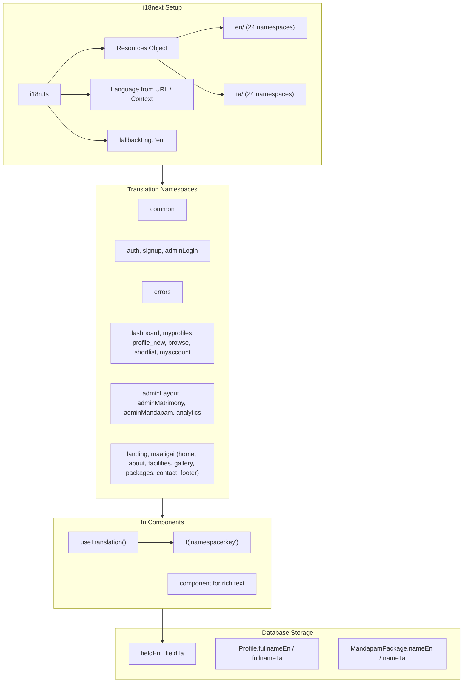
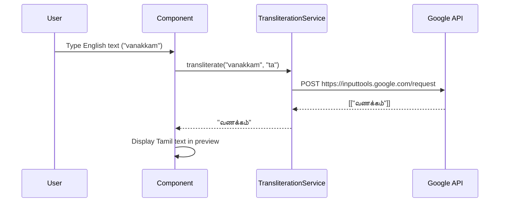

# i18n & Bilingual Architecture

## Internationalization Architecture



## Translation File Structure

```
locales/
├── index.ts                     # Aggregates all namespaces
├── en/
│   ├── admin/
│   │   ├── analytics.ts
│   │   ├── layout.ts
│   │   ├── mandapam.ts
│   │   └── matrimony.ts
│   ├── auth/
│   │   ├── auth.ts
│   │   ├── adminLogin.ts
│   │   └── signup.ts
│   ├── landing/
│   │   ├── home.ts
│   │   └── index.ts
│   ├── maaligai/
│   │   ├── about.ts
│   │   ├── contact.ts
│   │   ├── facilities.ts
│   │   ├── footer.ts
│   │   ├── gallery.ts
│   │   ├── home.ts
│   │   ├── index.ts
│   │   └── packages.ts
│   ├── user/
│   │   ├── browse.ts
│   │   ├── dashboard.ts
│   │   ├── myaccount.ts
│   │   ├── myprofiles.ts
│   │   ├── profile_new.ts
│   │   └── shortlist.ts
│   ├── common.ts
│   └── errors.ts
└── ta/                          # Mirror structure (24 files)
```

### Total: 48 translation files (24 EN + 24 TA)

## Language Switching

```typescript
// context/LanguageContext.tsx
const toggleLanguage = () => {
    const newLang = language === 'en' ? 'ta' : 'en'
    setLanguage(newLang)
    i18next.changeLanguage(newLang)
    // Persist to localStorage
}
```

### Key Principles
- UI language switch is **instant** (no page reload)
- All static text is in translation files
- User-generated content uses dual database fields (`fieldEn`/`fieldTa`)
- Language preference is **persisted** in localStorage

## Dual-Script UI Components

The app has sophisticated bilingual form components:

| Component | Purpose |
|---|---|
| `DualScriptField` | Two inputs side-by-side (EN + TA) |
| `DualScriptTextarea` | Two textareas side-by-side |
| `TranslatableInput` | Single input with "Translate to Tamil" button |
| `TranslatableTextarea` | Textarea with auto-translate |
| `TransliteratingTextarea` | Live transliteration as you type |
| `TransliteratedPreview` | Shows source + transliterated result |
| `TransliteratedInputPreview` | Input with live preview |
| `TamilKeyboard` | Virtual Tamil keyboard for devices without Tamil input |
| `PhoneticInput` | Type English, get Tamil phonetic output |

## Transliteration Service

```typescript
// utils/transliterationService.ts
// Uses Google Input Tools API: https://inputtools.google.com/request
// Transforms English/Latin input → Tamil script
// Used in: TransliteratingTextarea, PhoneticInput
```



## Translation Usage Rules

```typescript
// ✅ Correct: useTranslation hook
const { t } = useTranslation('auth')
return <h1>{t('auth:login.title')}</h1>

// ✅ Correct: namespace prefix
t('common:save')
t('errors:validation.required')

// ❌ Wrong: hardcoded strings
return <h1>"Login"</h1>

// ❌ Wrong: using t() without namespace for ambiguous keys
t('title') // Which namespace?
```

## Database Bilingual Pattern

All user-facing content in the database uses the dual-field pattern:

```prisma
model MandapamPackage {
    nameEn      String
    nameTa      String
    featuresEn  String[]
    featuresTa  String[]
    // Frontend picks the right field based on current language
}
```

**Frontend rendering:**
```typescript
const language = useLanguage() // from LanguageContext
const displayName = language === 'ta' ? package.nameTa : package.nameEn
```

## i18next Configuration

```typescript
// src/i18n.ts
i18next.use(initReactI18next).init({
    resources,
    fallbackLng: 'en',
    interpolation: { escapeValue: false }, // React already escapes
    returnObjects: true,
    ns: ['common', 'auth', 'signup', 'errors', /* ... all 14 namespaces */],
    defaultNS: 'common',
})
```

## What NOT To Do

- ❌ Do NOT hardcode text strings in components — always use `t()`
- ❌ Do NOT add English-only text to the database — always provide both `fieldEn` and `fieldTa`
- ❌ Do NOT use browser `navigator.language` for automatic detection — let user choose
- ❌ Do NOT mix translation key naming conventions — use dot-notation consistently
- ❌ Do NOT forget to add new translations to both EN and TA files
- ❌ Do NOT put HTML in translation strings — use `<Trans>` component or components
- ❌ Do NOT use `t()` outside of React components (i.e., in utility files) — pass translated strings as props
