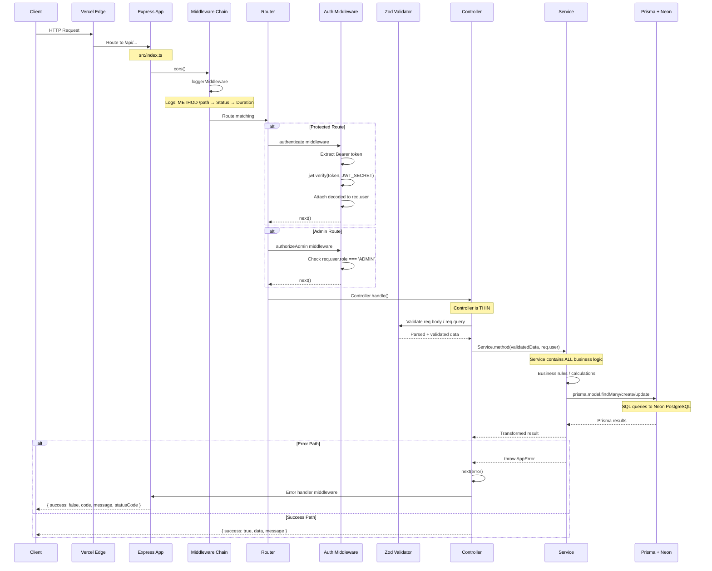
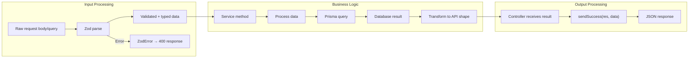

# Request Lifecycle

## Complete Request Flow



## Layer Responsibilities

| Layer | File | Responsibility | What NOT To Do |
|---|---|---|---|
| **Entry** | `src/index.ts` | Express app setup, middleware registration, route mounting | Don't put routes inline — use route files |
| **Middleware** | `middlewares/auth.ts`, `middlewares/logger.ts` | Request pre-processing: auth, logging, CORS | Don't put business logic here |
| **Router** | `routes/*.ts` | Map HTTP verb + path → controller | Don't add logic, don't call services directly |
| **Controller** | `controllers/*.ts` | Parse request, call service, send response | Don't put business logic, don't query DB |
| **Validator** | `utils/validators/*.ts` | Zod schema validation | Don't handle auth, don't access DB |
| **Service** | `services/*.ts` | ALL business logic, transaction handling, external calls | Don't access req/res, don't format HTTP responses |
| **Prisma** | `config/prisma.ts` | Database ORM client | Don't bypass via raw SQL unless necessary |
| **Utils** | `utils/*.ts` | Error formatting, response helpers | Don't contain business logic |

## Data Transformation Chain



## Error Propagation

```mermaid
flowchart TD
    Service["Service throws AppError"] -->|next(error)| Controller
    Prisma["Prisma error"] -->|catch| Service["Service wraps in AppError"]
    Zod["Zod validation fail"] -->|return 400| Controller["Controller returns early"]
    
    Controller --> ErrorHandler["Express error handler (index.ts)"]
    ErrorHandler --> Format{"Error type?"}
    Format -->|AppError| Known["Known error → sendError(code, message, status)"]
    Format -->|PrismaError| PrismaE["Prisma error → generic message (hide details)"]
    Format -->|Unknown| Unknown["Unknown → 500 Internal Server Error"]
    
    Known --> Prod{"Production?"}
    PrismaE --> Prod
    Unknown --> Prod
    Prod -->|Yes| Safe["Safe message (no stack trace)"]
    Prod -->|No| Verbose["Verbose (with stack trace)"]
```

## Debugging the Request Lifecycle

| Issue | Check |
|---|---|
| Request not reaching controller | Middleware threw before controller (check auth) |
| Wrong data in response | Check service transformation, not Prisma |
| Slow response | Check Prisma query time (enable query logging) |
| 401 when authenticated | Token expired, wrong JWT_SECRET, malformed header |
| 403 on admin route | User role is not ADMIN |
| 400 with no details | Zod validation failed — check request body shape |
| 500 with no details | Unhandled error — check server logs |
