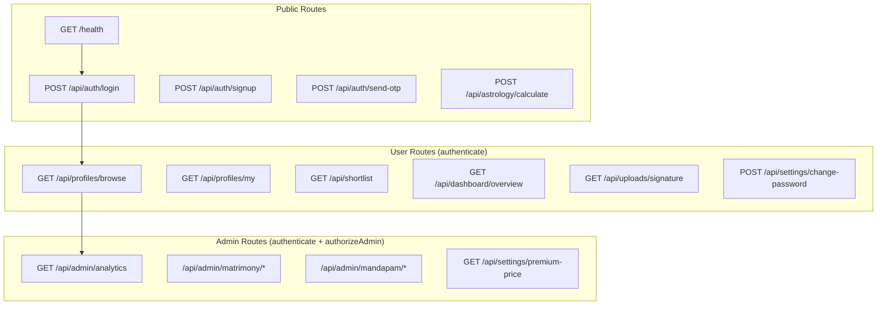
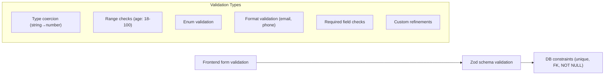

# API Architecture

## REST Conventions

| Convention | Standard | Example |
|---|---|---|
| **Base URL** | `/api/{resource}` | `/api/profiles` |
| **List** | `GET /api/{resource}` | `GET /api/profiles` |
| **Get one** | `GET /api/{resource}/:id` | `GET /api/profiles/abc123` |
| **Create** | `POST /api/{resource}` | `POST /api/profiles` |
| **Update** | `PATCH /api/{resource}/:id` | `PATCH /api/profiles/abc123` |
| **Delete** | `DELETE /api/{resource}/:id` | `DELETE /api/profiles/abc123` |
| **Actions** | `POST /api/{resource}/:id/{action}` | `POST /api/profiles/:id/status` |
| **Admin prefix** | `/api/admin/{resource}` | `/api/admin/mandapam/bookings` |

## Route Structure



## Response Format

### Success Response
```json
{
    "success": true,
    "data": { /* resource or array */ },
    "message": "Profiles fetched successfully"
}
```

### Paginated Response
```json
{
    "success": true,
    "data": [ /* items */ ],
    "pagination": {
        "total": 342,
        "page": 1,
        "limit": 20,
        "totalPages": 18
    },
    "message": "Profiles fetched successfully"
}
```

### Error Response
```json
{
    "success": false,
    "code": "PROFILE_NOT_FOUND",
    "message": "Profile with the given ID was not found",
    "statusCode": 404
}
```

## Validation Strategy

### Zod Schema Validation

```typescript
// utils/validators/profile.ts
import { z } from 'zod'

export const createProfileSchema = z.object({
    profileFor: z.nativeEnum(ProfileFor),
    fullnameEn: z.string().min(2).max(100),
    fullnameTa: z.string().min(2).max(100),
    dateOfBirth: z.string().regex(/^\d{4}-\d{2}-\d{2}$/),
    gender: z.nativeEnum(Gender),
    height: z.number().int().min(100).max(250),
    maritalStatus: z.nativeEnum(MaritalStatus),
    // ... more fields
})

// Used in controller:
const parsed = createProfileSchema.parse(req.body) // throws ZodError on failure
```

### Validation Layers



## Error Handling in API

```typescript
// utils/errors.ts — error codes enum
export enum ErrorCode {
    UNAUTHORIZED = 'UNAUTHORIZED',
    INVALID_TOKEN = 'INVALID_TOKEN',
    FORBIDDEN = 'FORBIDDEN',
    NOT_FOUND = 'NOT_FOUND',
    VALIDATION_ERROR = 'VALIDATION_ERROR',
    DUPLICATE_ENTRY = 'DUPLICATE_ENTRY',
    PROFILE_NOT_FOUND = 'PROFILE_NOT_FOUND',
    BOOKING_CONFLICT = 'BOOKING_CONFLICT',
    PLAN_LIMIT_REACHED = 'PLAN_LIMIT_REACHED',
    OTP_EXPIRED = 'OTP_EXPIRED',
    INVALID_OTP = 'INVALID_OTP',
    RATE_LIMIT_EXCEEDED = 'RATE_LIMIT_EXCEEDED',
    INTERNAL_ERROR = 'INTERNAL_ERROR',
}

// AppError class
export class AppError extends Error {
    constructor(
        public code: ErrorCode,
        public statusCode: number,
        message: string
    ) {
        super(message)
    }
}

// sendError response helper
export const sendError = (res: Response, status: number, code: ErrorCode, message?: string) => {
    res.status(status).json({
        success: false,
        code,
        message: message || code,
        statusCode: status,
    })
}
```

## API Versioning

**Current**: No explicit versioning (no `/v1/` prefix). The API is implicitly v1.

**Strategy**: If breaking changes are needed, add `/api/v2/` routes alongside v1, then deprecate v1 over a transition period.

## Rate Limiting

**Current**: No rate limiting implemented.

**Future Strategy** (see scalability docs):
- Tier 1: 100 req/min for authenticated users
- Tier 2: 20 req/min for unauthenticated
- Tier 3: 10 req/min for auth endpoints (OTP, login)
- Implemented via: Vercel WAF, or in-express middleware with in-memory store (or Redis when available)

## What NOT To Do

- ❌ Do NOT return stack traces in production API responses
- ❌ Do NOT use `res.json(undefined)` or `res.send(null)` for empty results — return `{ data: null }`
- ❌ Do NOT return 500 for client errors (400 class) or vice versa
- ❌ Do NOT expose internal IDs (`serialInt`) in public API responses
- ❌ Do NOT skip Zod validation for "simple" endpoints — all input must be validated
- ❌ Do NOT add `/api/v1/` without a deprecation plan for the old routes
- ❌ Do NOT use GET for mutations — follow REST conventions strictly
