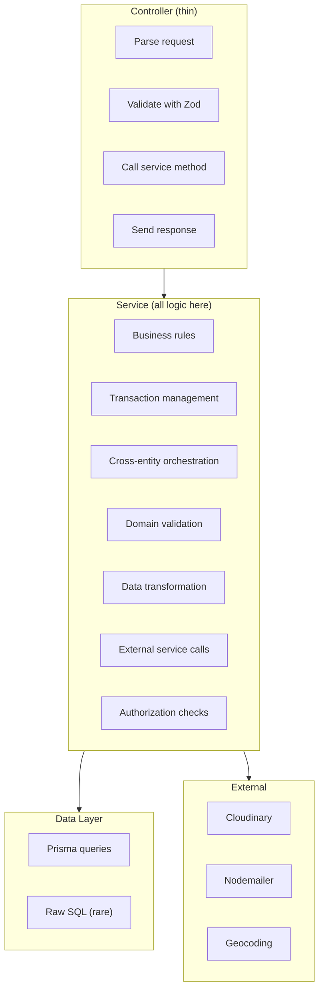
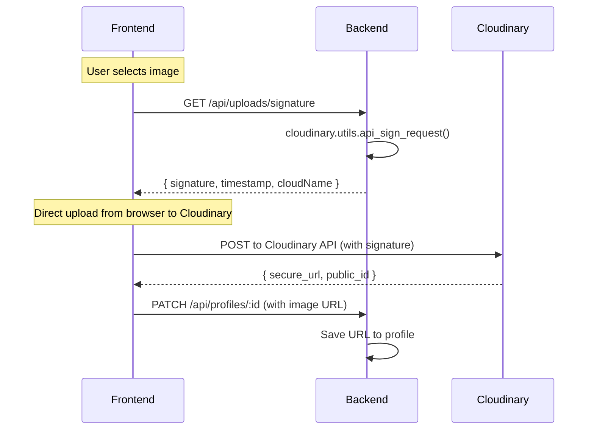

# Service Layer Architecture

## Service Layer Responsibility

The service layer is the **heart of the application** — ALL business logic lives here.



## Service Files

| Service | Key Methods | Business Logic |
|---|---|---|
| `auth.ts` | `signup()`, `login()`, `adminLogin()`, `verifyOtp()`, `sendOtp()` | Password hashing, JWT generation, OTP lifecycle |
| `profile.ts` | `getBrowseProfiles()`, `createProfile()`, `updateProfile()`, `deleteProfile()`, `uploadImage()`, `updateStatus()` | Filtering, regNo generation, visibility checks |
| `registration.service.ts` | `generateRegistrationNumber()` | Atomic district-based counter increment |
| `email.ts` | `sendOtpEmail()`, `sendNotification()` | HTML email composition, SMTP delivery |
| `cloudinary.service.ts` | `uploadImage()`, `deleteImage()`, `getSignature()` | Image transformation, signed uploads |
| `shortlist.ts` | `toggleShortlist()`, `getShortlist()` | Unique constraint enforcement, limit check |
| `mandapamBooking.service.ts` | `createBooking()`, `updateBooking()`, `cancelBooking()`, `addPayment()` | Session uniqueness, payment tracking, calendar |
| `mandapamPackage.service.ts` | `createPackage()`, `listPackages()`, `updatePackage()` | Package CRUD, status toggle |
| `adminMatrimony.service.ts` | `getAccounts()`, `suspendAccount()`, `upgradePlan()` | User management, plan management |
| `analytics.service.ts` | `getDashboardAnalytics()`, `getBasicStats()` | Aggregation queries, report generation |

## Transaction Handling

### Prisma Interactive Transactions
```typescript
// Atomic registration number generation
const result = await prisma.$transaction(async (tx) => {
    const counter = await tx.registrationCounter.update({
        where: { districtCode },
        data: { count: { increment: 1 } },
    })
    const regNo = `${districtCode}-${year}-${counter.count}`
    const user = await tx.user.create({
        data: { ...userData, regNo },
    })
    return user
})
```

### When to Use Transactions
| Scenario | Transaction Required? |
|---|---|
| Registration number generation | ✅ Yes (atomic increment) |
| Profile + Horoscope creation | ✅ Yes (two tables) |
| Booking + payment tracking | ✅ Yes (data integrity) |
| Simple read queries | ❌ No |
| Single table create/update | ❌ No (Prisma handles it) |

## Orchestration Patterns

### Sequential Orchestration
```typescript
// Controller orchestrates multiple services
async function createProfileAndImage(req, res) {
    // 1. Create profile
    const profile = await profileService.createProfile(req.body, req.user.id)
    
    // 2. Upload image (if provided)
    if (req.file) {
        const image = await cloudinaryService.uploadImage(req.file)
        await profileService.updateProfileImage(profile.id, image.url)
    }
    
    return profile
}
```

### Parallel Orchestration
```typescript
// Dashboard — multiple independent queries
const [stats, recentProfiles, pendingVerification] = await Promise.all([
    analyticsService.getBasicStats(),
    profileService.getRecentProfiles(5),
    profileService.getPendingVerificationCount(),
])
```

## External Service Integration

### Cloudinary Integration


### Email Integration
```typescript
// services/email.ts
// Uses Nodemailer with Gmail SMTP
// Templates: OTP email, registration confirmation, notification
// All emails are HTML formatted
```

## Orchestration Anti-Patterns

- ❌ Do NOT call service A from service B — orchestrator (controller or dedicated service) should coordinate
- ❌ Do NOT put transaction logic in controllers — controllers should not know about DB internals
- ❌ Do NOT create circular service dependencies
- ❌ Do NOT put external API call logic in controllers — always wrap in a service
- ❌ Do NOT make sequential API calls when parallel is possible (use `Promise.all`)
- ❌ Do NOT forget to handle partial failures in orchestration — implement compensation/rollback

## Service Layer Rules

- ✅ Services are stateless (no instance variables)
- ✅ Services receive all input as parameters (not from global/request state)
- ✅ Services throw `AppError` for business rule violations
- ✅ Services handle their own transaction management
- ✅ Services log meaningful debug information
- ❌ Services do NOT access `req` or `res` objects
- ❌ Services do NOT format HTTP responses
