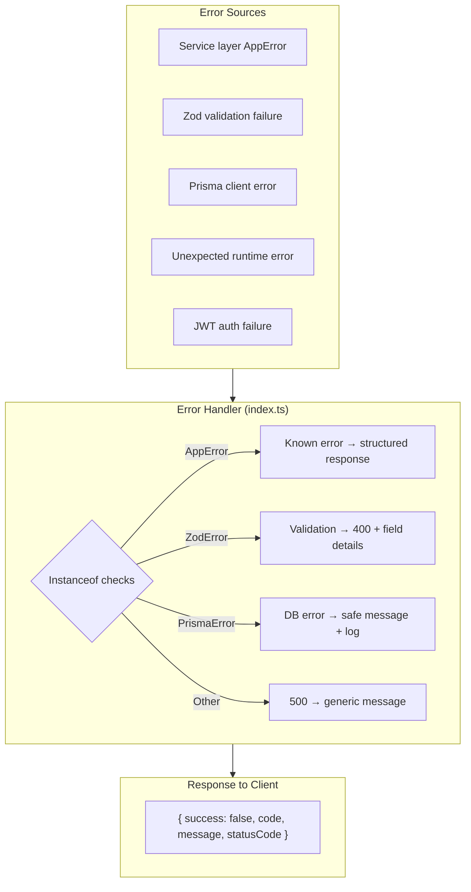

# Error Handling Strategy

## Centralized Error Architecture



## Error Code Reference

| Code | HTTP Status | When | Client Action |
|---|---|---|---|
| `UNAUTHORIZED` | 401 | No token provided | Redirect to login |
| `INVALID_TOKEN` | 401 | Token expired/malformed | Clear token, redirect to login |
| `FORBIDDEN` | 403 | Wrong role (not admin) | Show "access denied" |
| `NOT_FOUND` | 404 | Resource doesn't exist | Show "not found" |
| `VALIDATION_ERROR` | 400 | Zod validation failed | Show field errors |
| `DUPLICATE_ENTRY` | 409 | Unique constraint violation | Show "already exists" |
| `BOOKING_CONFLICT` | 409 | Date+session taken | Show "slot unavailable" |
| `PLAN_LIMIT_REACHED` | 403 | Free tier limit exceeded | Show upgrade prompt |
| `OTP_EXPIRED` | 400 | OTP too old | Request new OTP |
| `INVALID_OTP` | 400 | Wrong OTP | Show "invalid OTP" |
| `INTERNAL_ERROR` | 500 | Unexpected error | Show "something went wrong" |

## Structured Error Response Format

```typescript
// Success
{ success: true, data: { ... }, message: "..." }

// Error
{ 
    success: false, 
    code: "BOOKING_CONFLICT", 
    message: "The morning session on 2024-12-25 is already booked",
    statusCode: 409
}
```

## Error Handler Implementation

```typescript
// backend/src/index.ts (simplified)
app.use((err: Error, req: Request, res: Response, next: NextFunction) => {
    // Known application errors
    if (err instanceof AppError) {
        return sendError(res, err.statusCode, err.code, err.message)
    }
    
    // Zod validation errors
    if (err instanceof ZodError) {
        return sendError(res, 400, ErrorCode.VALIDATION_ERROR, err.errors)
    }
    
    // Prisma errors
    if (err instanceof Prisma.PrismaClientKnownRequestError) {
        if (err.code === 'P2002') { // Unique constraint
            return sendError(res, 409, ErrorCode.DUPLICATE_ENTRY)
        }
        if (err.code === 'P2025') { // Record not found
            return sendError(res, 404, ErrorCode.NOT_FOUND)
        }
    }
    
    // Unknown errors — don't expose details in production
    console.error('Unhandled error:', err)
    const message = process.env.NODE_ENV === 'production'
        ? 'An unexpected error occurred'
        : err.message
    return sendError(res, 500, ErrorCode.INTERNAL_ERROR, message)
})
```

## Prisma Error Handling

| Prisma Error Code | Meaning | Our Error |
|---|---|---|
| `P2002` | Unique constraint violation | `DUPLICATE_ENTRY` (409) |
| `P2025` | Record not found | `NOT_FOUND` (404) |
| `P2003` | Foreign key constraint | `VALIDATION_ERROR` (400) |
| `P2014` | Required relation violation | `VALIDATION_ERROR` (400) |
| `P1001` | Connection error | `INTERNAL_ERROR` (500) |

## Retry Strategy

| Operation | Retry? | Strategy |
|---|---|---|
| Prisma connection | Yes | 3 retries, exponential backoff (Prisma built-in) |
| Cloudinary upload | Yes | 3 retries, 1s delay |
| Email send | No | Fail immediately, log error |
| API response | No | Fail immediately — retry is client's responsibility |

## Frontend-Safe Errors

The frontend should NEVER display raw error messages to users. All errors flow through:

```typescript
// Error display layer (frontend)
const errorMessage = error.code 
    ? t(`errors:${error.code}`) // Translation key
    : t('errors:generic')
toast.error(errorMessage)
```

## Logging Strategy

```typescript
// middleware/logger.ts
// Logs: METHOD /path → STATUS [DURATION]
// Example: POST /api/auth/login → 200 [245ms]

// In services:
console.error(`[ProfileService] Failed to create profile: ${error.message}`)
// Never log: passwords, tokens, OTPs, personal data
```

## What NOT To Do

- ❌ Do NOT catch errors and return 200 with `{ error: true }` — use proper HTTP status codes
- ❌ Do NOT expose Prisma error details to the client — they reveal schema information
- ❌ Do NOT log passwords, tokens, or personal data
- ❌ Do NOT swallow errors silently — always log or re-throw
- ❌ Do NOT use `console.log` for debugging — use `console.error` or structured logging
- ❌ Do NOT return `{ message: "error" }` without a machine-readable error code
- ❌ Do NOT put error handling in every controller — let the centralized handler do it
