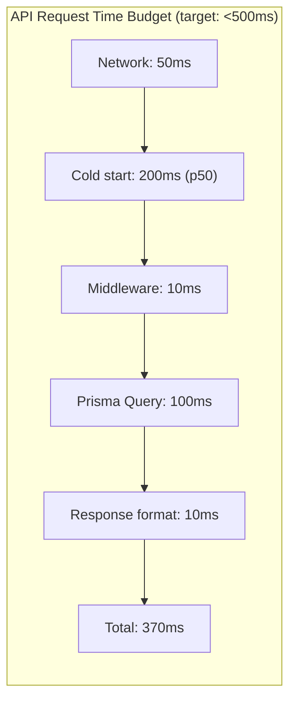

# Backend Performance

## Connection Pooling

### Prisma Connection Management

```typescript
// config/prisma.ts — Singleton pattern
const globalForPrisma = globalThis as unknown as { prisma: PrismaClient }
export const prisma = globalForPrisma.prisma ?? new PrismaClient({
    log: process.env.NODE_ENV === 'development' ? ['query', 'error'] : ['error'],
})
if (process.env.NODE_ENV !== 'production') globalForPrisma.prisma = prisma
```

### Neon Connection Pooling

Neon PostgreSQL uses **PgBouncer-compatible connection pooling**:

| Setting | Value | Rationale |
|---|---|---|
| Pool mode | Transaction | Release connection after each transaction |
| Max connections | 10 (free tier) | Neon free tier limit |
| Connection timeout | 10s | Serverless function timeout |
| Idle timeout | 300s | Close idle connections |

### Pool Exhaustion Prevention

| Strategy | Implementation |
|---|---|
| Singleton pattern | Prevent multiple Prisma instances on hot-reload |
| Connection limiting | Prisma's built-in pool (default: num_ CPUs × 2 + 1) |
| Query timeouts | `statement_cache_size = 0` for serverless |
| Keep-alive | Prisma handles TCP keep-alive |

## Query Optimization

### N+1 Query Prevention

```typescript
// ❌ BAD: N+1 queries
const profiles = await prisma.profile.findMany()
for (const profile of profiles) {
    const user = await prisma.user.findUnique({ where: { id: profile.userId } })
}

// ✅ GOOD: Include relations
const profiles = await prisma.profile.findMany({
    include: {
        user: { select: { fullnameEn: true, fullnameTa: true } },
        horoscope: true,
    }
})
```

### Selective Field Loading

```typescript
// ❌ BAD: Loading all fields
const profiles = await prisma.profile.findMany()

// ✅ GOOD: Only load needed fields (using selects.ts constants)
import { profileMinSelect } from '../constants/selects'

const profiles = await prisma.profile.findMany({
    select: profileMinSelect, // Only fields needed for browse card
})
```

### Pagination

```typescript
// Server-side pagination for all list endpoints
const page = parseInt(req.query.page as string) || 1
const limit = parseInt(req.query.limit as string) || 20
const skip = (page - 1) * limit

const [data, total] = await Promise.all([
    prisma.profile.findMany({ skip, take: limit, /* where, orderBy */ }),
    prisma.profile.count({ /* where */ }),
])

return { data, pagination: { total, page, limit, totalPages: Math.ceil(total / limit) } }
```

## Indexing Strategy

```prisma
// Critical indexes already in schema.prisma:
model Profile {
    @@index([gender, status, adminVerified])   // Browse filter: gender + active + verified
    @@index([currentDistrict])                  // Location filter
    @@index([kulam])                            // Community filter
    @@index([age])                              // Age range filter
    @@index([salaryMonthly])                    // Salary filter
    @@index([height])                           // Height range filter
    @@index([dosham])                           // Dosham filter
    @@index([rasi])                             // Astrology filter
    @@index([maritalStatus])                    // Marital status filter
    @@index([star])                             // Star filter
    @@index([diet])                             // Diet filter
}

model MandapamBooking {
    @@unique([date, session])                   // Prevent double-booking
    @@index([date])                             // Calendar queries
    @@index([paymentStatus])                    // Payment tracking
    @@index([createdBy])                        // Admin's bookings
}
```

See [Database Indexing Strategy](../05-database/02-indexing-strategy.md) for detailed index rationale.

## Serverless Optimization

### Cold Start Mitigation

| Strategy | Impact |
|---|---|
| Minimal dependencies in `package.json` | Faster Lambda unpacking |
| Prisma engine included in bundle | No download at cold start |
| Keep-alive pings (future) | Function stays warm |
| Lazy load astrology engine | Not loaded unless astrology endpoint is hit |

### Response Time Budget



## Query Batching

### Dashboard Parallel Queries
```typescript
// Use Promise.all for independent queries
const [totalUsers, totalProfiles, pendingVerification, recentBookings] = 
    await Promise.all([
        prisma.user.count(),
        prisma.profile.count({ where: { status: 'ACTIVE' } }),
        prisma.profile.count({ where: { adminVerified: 'PENDING' } }),
        prisma.mandapamBooking.findMany({ orderBy: { createdAt: 'desc' }, take: 5 }),
    ])
```

## Caching

**Current**: No server-side caching. TanStack Query handles client-side caching.

**Future**: Redis caching for:
- Browse profiles (stale-while-revalidate)
- Admin analytics (TTL: 5 minutes)
- Astrology calculations (heavy computation)
- Calendar data (changes infrequently)

## Slow Query Detection

```typescript
// Enable Prisma query logging in development
const prisma = new PrismaClient({
    log: process.env.NODE_ENV === 'development' 
        ? ['query', 'info', 'warn', 'error'] 
        : ['error'],
})

// Watch for:
// - Queries taking >100ms
// - Sequential queries in loops (N+1)
// - Missing WHERE clauses (full table scans)
// - Large OFFSET values (deep pagination)
```

## What NOT To Do

- ❌ Do NOT disable Prisma connection pooling — it's essential for serverless
- ❌ Do NOT create new PrismaClient instances — always use the singleton
- ❌ Do NOT use `select: *` or omit `select` when you only need a few fields
- ❌ Do NOT use `OFFSET` for deep pagination — use cursor-based for >10K rows
- ❌ Do NOT make sequential DB queries when they can be parallel
- ❌ Do NOT fetch related data in loops (N+1) — use Prisma `include` or `JOIN`
