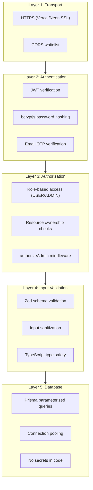

# Backend Security

## Security Layers



## SQL Injection Prevention

**Prisma ORM** inherently prevents SQL injection by using parameterized queries:

```typescript
// ✅ SAFE: Prisma parameterized query
await prisma.user.findUnique({ where: { email: userInput } })

// ❌ DANGEROUS: Raw SQL with interpolation (never do this)
await prisma.$queryRawUnsafe(`SELECT * FROM users WHERE email = '${userInput}'`)
```

**Rule**: Always use Prisma's built-in query methods. Only use `$queryRaw` with template literals (which are parameterized):

```typescript
// ✅ SAFE: Prisma raw query with template literal (parameterized)
await prisma.$queryRaw`SELECT * FROM users WHERE email = ${userInput}`
```

## Input Validation

### All User Input Must Be Validated

| Input Source | Validation | Location |
|---|---|---|
| Request body | Zod schema | Controller |
| Request query params | Zod schema (manual parse) | Controller |
| URL params | Type check + existence check | Controller |
| File uploads | Cloudinary + size/mime check | Service |
| Headers | JWT verify + format check | Middleware |

## Rate Limiting

**Current**: No rate limiting. **Critical gap**.

**Planned** (see [Scalability / Caching](../07-scalability/01-caching-strategy.md)):

| Endpoint | Rate Limit | Rationale |
|---|---|---|
| `POST /api/auth/login` | 10 req/min per IP | Prevent brute force |
| `POST /api/auth/send-otp` | 3 req/min per email | Prevent OTP spam |
| `POST /api/auth/signup` | 3 req/min per IP | Prevent account creation spam |
| All other endpoints | 100 req/min per user | General API protection |

## Environment Variable Security

```bash
# ✅ CORRECT: .env is in .gitignore, never committed
# ✅ CORRECT: NODE_ENV switches error verbosity
# ✅ CORRECT: Production values set in Vercel dashboard, not in code

# ❌ WRONG: Hardcoded secrets in source code
# ❌ WRONG: Committing .env files to git
# ❌ WRONG: Logging environment variables
```

### Env Validation at Startup
```typescript
// Backend should validate required env vars at startup:
const requiredEnvs = ['DATABASE_URL', 'JWT_SECRET', 'CLOUDINARY_CLOUD_NAME']
for (const env of requiredEnvs) {
    if (!process.env[env]) {
        throw new Error(`Missing required environment variable: ${env}`)
    }
}
```

## Auth Protection

### Password Security
```typescript
// Password hashing with bcryptjs
const salt = await bcrypt.genSalt(10)  // Cost factor 10
const hash = await bcrypt.hash(password, salt)

// Verification
const isValid = await bcrypt.compare(inputPassword, storedHash)
```

### JWT Security
```typescript
// Token signing
const token = jwt.sign(
    { userId: user.id, role: user.role, email: user.email },
    process.env.JWT_SECRET!,
    { expiresIn: '7d' }
)

// No sensitive data in payload (no password, no phone)
// Short expiry (7 days) — not indefinite
// Single secret key (no key rotation — future improvement)
```

## API Abuse Prevention

| Threat | Prevention |
|---|---|
| Enumeration (user IDs) | Use UUIDs, not sequential integers |
| Enumeration (email) | Generic error message ("invalid credentials") |
| Mass assignment | Zod schemas whitelist allowed fields |
| Parameter pollution | Early return on duplicate params |
| Request smuggling | Express 5 body parser handles this |
| Infinite scroll abuse | Server-side pagination with max limit |

## Sensitive Data Masking

```typescript
// middleware/logger.ts
// Passwords, tokens, and OTPs are masked in logs:
const maskSensitive = (body: any) => {
    const masked = { ...body }
    if (masked.password) masked.password = '***'
    if (masked.otp) masked.otp = '***'
    if (masked.token) masked.token = '***'
    return masked
}
```

## What NOT To Do

- ❌ Do NOT use `$queryRawUnsafe` — always use parameterized queries
- ❌ Do NOT trust frontend validation — always re-validate on backend
- ❌ Do NOT expose stack traces in production error responses
- ❌ Do NOT hardcode secrets in source code (even in comments)
- ❌ Do NOT return "user not found" vs "wrong password" — use "invalid credentials" for both
- ❌ Do NOT log passwords, tokens, OTPs, or personal data
- ❌ Do NOT disable CORS in production — always whitelist specific origins
- ❌ Do NOT skip auth middleware on any route that should be protected
