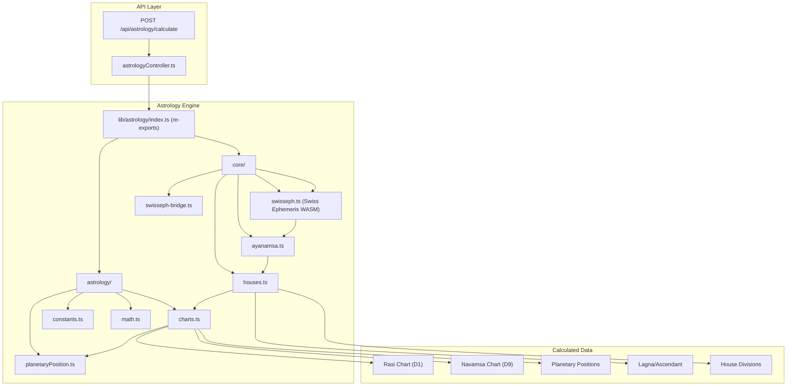
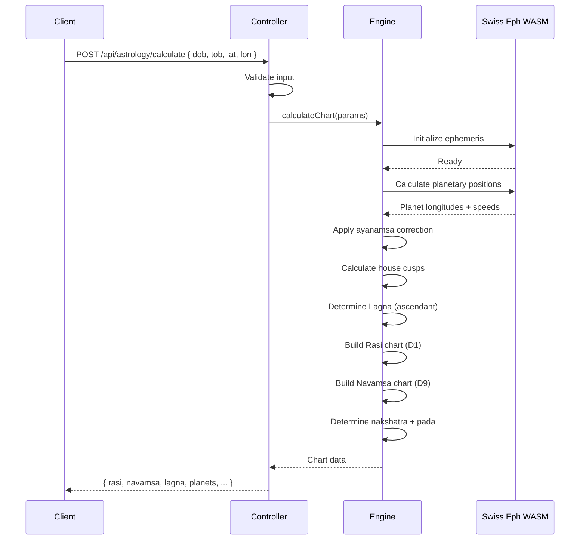

# Vedic Astrology Engine

## Architecture

The astrology engine is a **self-contained calculation system** that computes Vedic (Jyotisha) astrology charts based on Swiss Ephemeris data.



## Engine Components

| Component | File | Responsibility |
|---|---|---|
| **Swiss Ephemeris** | `swisseph.ts` | WASM wrapper for Swiss Ephemeris C library |
| **Swiss Bridge** | `swisseph-bridge.ts` | Type-safe bridge between JS and WASM |
| **Ayanamsa** | `ayanamsa.ts` | Precession of equinoxes correction (Lahiri ayanamsa) |
| **Houses** | `houses.ts` | House cusp calculation (Equal/Placidus systems) |
| **Charts** | `charts.ts` | Rasi (D1) and Navamsa (D9) chart generation |
| **Constants** | `constants.ts` | Planet IDs, sign names, nakshatra boundaries |
| **Planetary Position** | `planetaryPosition.ts` | Planet longitude, latitude, speed at given datetime |
| **Math** | `math.ts` | Astronomical math utilities |

## Data Flow



## Calculation Details

### 1. Planetary Positions
- Calculates geocentric longitudes for all 9 grahas (planets)
- Includes: Sun, Moon, Mars, Mercury, Jupiter, Venus, Saturn, Rahu, Ketu
- Corrected for **Lahiri ayanamsa** (precession of equinoxes)

### 2. House Cusps
- Uses **Equal House** system (common in South Indian astrology)
- Ascendant (Lagna) determines house 1 cusp
- Each house = 30 degrees from Lagna

### 3. Rasi Chart (D1)
- 12 houses mapped to 12 rasis (signs)
- Each planet placed in its rasi based on corrected longitude
- Lagna shown in house 1

### 4. Navamsa Chart (D9)
- Harmonic chart: each sign divided into 9 parts
- Used for marriage compatibility analysis
- Each navamsa = 3°20'

### 5. Nakshatra Determination
- 27 nakshatras (lunar mansions), each 13°20'
- Moon's nakshatra + pada determined from Moon's longitude
- Used for matching in matrimony

## Performance Considerations

| Aspect | Current | Optimization |
|---|---|---|
| Calculation time | ~200-500ms per chart | WASM computation is fast |
| WASM initialization | ~100ms (cold start) | Keep alive / lazy load |
| Concurrent requests | Sequential (no queue) | Add queue for high load |
| Caching | None | Cache results by birth details |

## Usage in Profile Creation

```typescript
// Profile creation stores astrological data:
{
    rasi: "MESHA",
    star: "ASHWINI",  // Nakshatra
    dosham: "NO",
    horoscope: {
        mode: "CREATE",  // or "UPLOAD"
        rasi: "{ chart data JSON }",
        navamsa: "{ chart data JSON }"
    }
}
```

## What NOT To Do

- ❌ Do NOT modify the astrology engine without understanding Vedic astronomy
- ❌ Do NOT change ayanamsa values without referencing modern ephemeris data
- ❌ Do NOT remove the WASM initialization check — it's required for correct calculations
- ❌ Do NOT calculate charts synchronously in request handlers for many users — queue it
- ❌ Do NOT mix house systems (Equal vs Placidus) without clear intent
- ❌ Do NOT expose raw Swiss Ephemeris errors to the frontend
