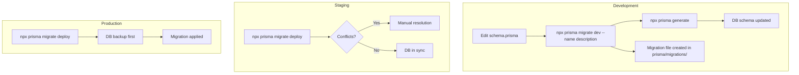

# Migration Workflow

## Prisma Migration Commands



## Migration Workflow

### Development
```bash
# 1. Edit schema.prisma
# 2. Create migration
npx prisma migrate dev --name add-profile-education-index

# 3. This:
#    - Creates migration file in prisma/migrations/
#    - Applies to local DB
#    - Generates Prisma client
#    - Prompts for reset if schema drift detected
```

### Production
```bash
# 1. Commit migration files to git
# 2. Deploy to Vercel
# 3. Run migration (via Vercel CLI or manual)
npx prisma migrate deploy

# Verify:
npx prisma migrate status
```

## Seeding

```bash
# Seed command defined in package.json:
# "prisma": { "seed": "ts-node prisma/seed.ts" }

# Run seed:
npx prisma db seed
```

### Seed Files
| File | Purpose |
|---|---|
| `prisma/seed.ts` | Admin account creation |
| `prisma/seed_packages.ts` | Mandapam package data |
| `prisma/seed_mandapam_data.ts` | Sample bookings |
| `prisma/mock.ts` | Mock data for development |

## Migration Rules

| Rule | Rationale |
|---|---|
| **Never edit migration files after creation** | They represent a historical record |
| **Always use `migrate dev` in development** | `db push` doesn't create migration files |
| **Always use `migrate deploy` in production** | `migrate dev` resets data |
| **Commit ALL migration files to git** | Required for production deployment |
| **Test migrations on staging first** | Catch issues before production |
| **Backup database before production migration** | Rollback capability |
| **Avoid breaking changes in migrations** | Rename columns, not delete them |

## Common Migration Scenarios

### Adding a Column
```prisma
model Profile {
    // Add:
    middleName    String?  // nullable — no breaking change
}
```

### Renaming a Column (3-step safe process)
```bash
# Step 1: Add new column (nullable)
npx prisma migrate dev --name add-middle-name

# Step 2: Backfill data (separate script)
# Update all rows: new_column = old_column

# Step 3: Remove old column
npx prisma migrate dev --name remove-old-column
```

### Adding an Index
```prisma
model Profile {
    @@index([createdAt])  // Non-blocking — safe to add
}
```

### Adding a Required Column (with default)
```prisma
model Profile {
    timezone    String  @default("Asia/Kolkata")  // Default prevents null issues
}
```

## Schema Drift Detection

```bash
# Check if schema and database are in sync:
npx prisma migrate status

# If "Drift detected":
# 1. Don't panic — check what changed
# 2. If intentional → create migration
# 3. If accidental → reset from migration
npx prisma migrate reset  # ⚠️ API: DESTROYS DATA
```

## What NOT To Do

- ❌ Do NOT run `prisma db push` in production — use `migrate deploy`
- ❌ Do NOT delete migration files from `prisma/migrations/`
- ❌ Do NOT manually edit the database schema outside Prisma
- ❌ Do NOT run `prisma migrate reset` on production databases
- ❌ Do NOT make non-backward-compatible changes without a transition plan
- ❌ Do NOT forget to run `prisma generate` after schema changes
- ❌ Do NOT use `prisma migrate dev --name` in production — it's for development only
