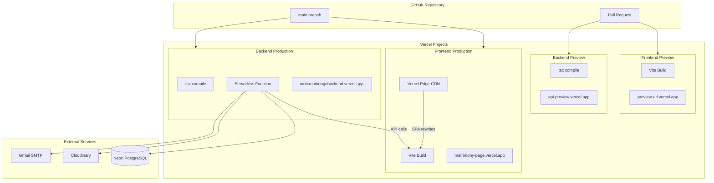

# Vercel Deployment

## Deployment Architecture



## Frontend Deployment

### vercel.json
```json
{
    "rewrites": [{ "source": "/(.*)", "destination": "/index.html" }]
}
```

### Build Settings (Vercel Dashboard)
| Setting | Value |
|---|---|
| Framework | Vite |
| Build Command | `npm run build` |
| Output Directory | `dist` |
| Install Command | `npm install` |
| Node Version | 20.x |

### Environment Variables (Set in Vercel Dashboard)
| Variable | Value |
|---|---|
| `VITE_API_URL` | `https://mohanurkongubackend.vercel.app/api` |
| `VITE_API_BASE_URL` | `https://mohanurkongubackend.vercel.app` |

## Backend Deployment

### vercel.json
```json
{
    "version": 2,
    "builds": [
        {
            "src": "src/index.ts",
            "use": "@vercel/node"
        }
    ],
    "routes": [
        { "src": "/api/(.*)", "dest": "src/index.ts" },
        { "src": "/health", "dest": "src/index.ts" }
    ]
}
```

### Build Settings (Vercel Dashboard)
| Setting | Value |
|---|---|
| Framework | Other |
| Build Command | `npx prisma generate && npm run build` |
| Output Directory | `.vercel/output` |
| Install Command | `npm install` |
| Node Version | 20.x |
| Root Directory | `backend/` |

### Environment Variables (Set in Vercel Dashboard)
| Variable | Source |
|---|---|
| `DATABASE_URL` | Neon connection string |
| `JWT_SECRET` | Generated secret |
| `CLOUDINARY_CLOUD_NAME` | Cloudinary dashboard |
| `CLOUDINARY_API_KEY` | Cloudinary dashboard |
| `CLOUDINARY_API_SECRET` | Cloudinary dashboard |
| `EMAIL_HOST` | `smtp.gmail.com` |
| `EMAIL_USER` | Gmail address |
| `EMAIL_PASS` | Gmail app password |
| `FRONTEND_URL` | Frontend production URL |
| `NODE_ENV` | `production` |

## Deployment Flow

```bash
# 1. Push to main branch
git push origin main

# 2. Vercel auto-deploys (both projects)
#    - Frontend: ~2 min build
#    - Backend: ~3 min build (includes Prisma generate)

# 3. Run production migration (if schema changed)
#    via Vercel CLI or manual:
npx vercel --prod --cwd backend
npx prisma migrate deploy
```

## Vercel Monitoring

| Metric | Where to Check |
|---|---|
| Function invocations | Vercel Dashboard → Backend → Analytics |
| Function errors | Vercel Dashboard → Backend → Logs |
| Function duration | Vercel Dashboard → Backend → Analytics |
| Cold starts | Vercel Dashboard → Backend → Analytics |
| Bandwidth | Vercel Dashboard → Frontend → Analytics |
| Build logs | Vercel Dashboard → Deployments |

## Production Health Check

```bash
# Check backend is alive:
curl https://mohanurkongubackend.vercel.app/health
# Expected: { "status": "ok", "timestamp": "..." }

# Check frontend loads:
curl https://matrimony-page.vercel.app/
# Expected: index.html (SPA shell)
```

## Scaling Limits (Vercel Hobby Plan)

| Limit | Value |
|---|---|
| Serverless function timeout | 10s (Hobby), 60s (Pro) |
| Function memory | 1024 MB |
| Concurrent executions | 1000 (Hobby), 5000 (Pro) |
| Bandwidth | 100 GB/mo (Hobby) |
| Build minutes | 6000/mo (Hobby) |

## What NOT To Do

- ❌ Do NOT run `prisma migrate dev` in production — use `migrate deploy`
- ❌ Do NOT set `NODE_ENV=development` in production — disables error masking
- ❌ Do NOT commit Vercel deployment tokens to git
- ❌ Do NOT use `npm run dev` as the build command — it starts a dev server
- ❌ Do NOT create Vercel projects with auto-deploy from non-main branches without preview settings
- ❌ Do NOT expose `DATABASE_URL` in frontend environment variables
