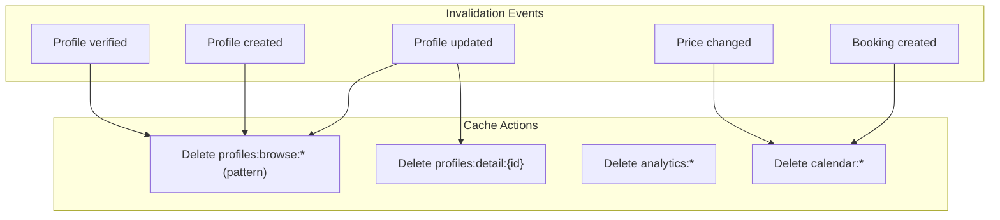

# Caching Strategy

## Current State vs Future

```mermaid
flowchart LR
    subgraph Current["Current (No Server Cache)"]
        TanStack["TanStack Query (browser cache)"]
        Browser["Browser HTTP cache"]
    end
    
    subgraph Future["Future Cache Layers"]
        Redis["Redis Layer"]
        CDN["Vercel Edge Cache"]
        SW["Service Worker Cache"]
    end
    
    subgraph Benefits["What Redis Would Unlock"]
        B1["Rate limiting (sliding window)"]
        B2["JWT blacklist (logout all devices)"]
        B3["Session/otp storage (instead of DB)"]
        B4["Browse profile cache (stale-while-revalidate)"]
        B5["Analytics cache (5-min TTL)"]
        B6["Astrology cache (avoid recomputation)"]
    end
    
    Current --> Future
    Future --> Benefits
```



## What to Cache (Priority Order)

| Priority | Data | TTL | Rationale |
|---|---|---|---|
| P0 | Browse profiles (filtered results) | 1 min | Most queried endpoint |
| P0 | JWT blacklist | Until expiry | Session revocation |
| P1 | Admin analytics | 5 min | Dashboard data |
| P1 | Astrology calculations | 30 days | Same input = same chart |
| P1 | OTP storage | 10 min | Move from DB to Redis for speed |
| P2 | Calendar data | 1 hour | Changes infrequently |
| P2 | Profile detail pages | 5 min | Read-heavy |
| P3 | Rate limit counters | 1 min | Sliding window |

## Redis Cache Design (Future)

```typescript
// Future Redis integration pattern:
class ProfileCache {
    private redis: Redis
    
    async getBrowseProfiles(filters: BrowseFilters): Promise<Profile[]> {
        const cacheKey = `profiles:browse:${hash(filters)}`
        
        // Try cache first
        const cached = await this.redis.get(cacheKey)
        if (cached) return JSON.parse(cached)
        
        // Miss — fetch from DB
        const profiles = await profileService.getBrowseProfiles(filters)
        
        // Set cache with TTL
        await this.redis.setex(cacheKey, 60, JSON.stringify(profiles))
        
        return profiles
    }
}
```

## Cache Invalidation Strategy



## CDN Caching (Vercel Edge)

| Resource | Cache Header | TTL |
|---|---|---|
| Static JS/CSS | `Cache-Control: public, max-age=31536000, immutable` | 1 year (content-hashed) |
| Images (Cloudinary) | Cloudinary-managed | Optimized |
| API responses | `Cache-Control: no-store` | Never (auth-dependent) |
| Public profile pages | `Cache-Control: public, max-age=60` | 1 min (if enabled) |

## What NOT To Do

- ❌ Do NOT implement Redis caching without a fallback — cache should never be a single point of failure
- ❌ Do NOT cache user-specific data without the user ID in the cache key
- ❌ Do NOT set excessively long TTLs — data staleness is a UX problem
- ❌ Do NOT cache mutations (POST/PUT/DELETE responses)
- ❌ Do NOT use Redis on every request — cache only high-traffic, low-change data
- ❌ Do NOT cache auth tokens — they're validated on every request
