# Scalability Documentation

## Current Scale Analysis

| Metric | Current Estimate | Scaling Trigger |
|---|---|---|
| Users | < 1,000 | Growth marketing |
| Active profiles | < 500 | Community growth |
| Bookings/month | < 50 | Mandapam popularization |
| API requests/day | < 10,000 | Public launch |
| DB size | < 1GB | Profile + image metadata growth |

## Scaling Trajectory

```mermaid
flowchart LR
    subgraph Phase1["Phase 1: Current"]
        P1_1["Monolithic backend (Express)"]
        P1_2["Single DB (Neon free)"]
        P1_3["No server cache"]
        P1_4["Vercel Hobby"]
    end
    
    subgraph Phase2["Phase 2: Growth (0-10K users)"]
        P2_1["+ Redis caching"]
        P2_2["+ Neon Scale plan"]
        P2_3["+ Vercel Pro"]
        P2_4["+ Rate limiting"]
    end
    
    subgraph Phase3["Phase 3: Scale (10K-100K users)"]
        P3_1["Background jobs (Queue)"]
        P3_2["Read replicas"]
        P3_3["CDN for assets"]
        P3_4["WebSocket for real-time"]
    end
    
    subgraph Phase4["Phase 4: Enterprise (100K+)"]
        P4_1["Microservice extraction"]
        P4_2["Multi-region DB"]
        P4_3["Full observability"]
        P4_4["Dedicated infrastructure"]
    end
    
    Phase1 --> Phase2 --> Phase3 --> Phase4
```

## Microservice Extraction Candidates

| Service | Extraction Point | Reason |
|---|---|---|
| **Auth Service** | Phase 2-3 | Separate auth concerns, independent scaling |
| **Astrology Service** | Phase 2 | Heavy computation, can be separate worker |
| **Notification Service** | Phase 3 | Email/SMS/WhatsApp — async |
| **Analytics Service** | Phase 3 | Heavy aggregation queries |
| **Image Service** | Phase 3 | Cloudinary is already external |
| **Payment Service** | Phase 2 | Payment processing needs isolation |

## Performance Budgets

| Metric | Current | Target (Phase 2) | Target (Phase 3) |
|---|---|---|---|
| API P95 response time | < 1s | < 500ms | < 200ms |
| Browse profiles query | < 500ms | < 200ms | < 100ms |
| Booking calendar query | < 200ms | < 100ms | < 50ms |
| Page load (frontend) | < 3s | < 2s | < 1.5s |
| Auth (login/signup) | < 1s | < 500ms | < 300ms |

## Key Scalability Principles

1. **Stateless backend** — All state in DB/Redis; backend can scale horizontally
2. **Cache aggressively** — Browse profiles, analytics, astrology
3. **Async where possible** — Email, notifications, heavy computations
4. **Database efficiency** — Proper indexes, query optimization, read replicas
5. **CDN first** — Static assets, images, public data on edge
6. **Rate limit early** — Prevent abuse before it becomes a problem
