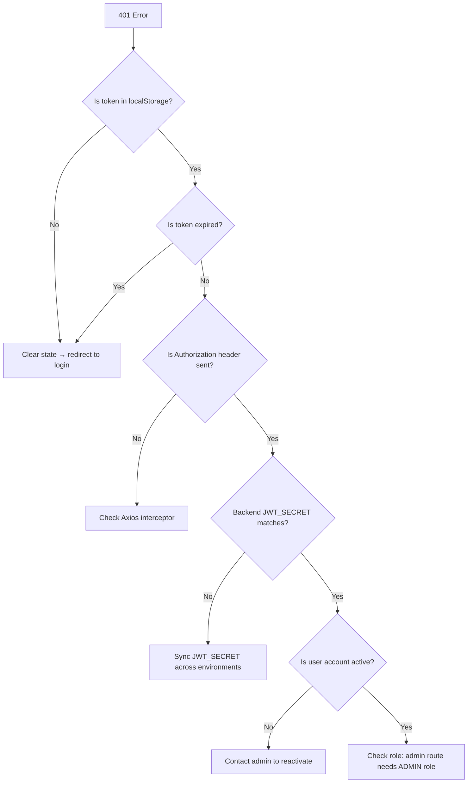

# Troubleshooting: Authentication Failures

## Symptoms
- `401 Unauthorized` on every API call
- Logged out after page refresh
- "Invalid credentials" on correct login
- Admin routes return 403

## Root Causes

| Cause | Check | Fix |
|---|---|---|
| **Token expired** | `jwt.decode(token).exp` < Date.now()/1000 | Re-login |
| **Wrong JWT_SECRET** | Backend env vs token signature | Match secrets |
| **No Authorization header** | API request headers | Axios interceptor |
| **localStorage cleared** | Browser dev tools → Application → Storage | Re-login |
| **Wrong user role** | `jwt.decode(token).role` !== 'ADMIN' | Check role mapping |
| **User suspended** | DB `User.accountStatus === 'SUSPENDED'` | Admin reactivation |
| **Token on wrong auth path** | User token on `/api/admin/*` | Separate user/admin tokens |

## Debugging Flow



## Password Issues

### Cannot Login
```bash
# 1. Check email exists in DB
# 2. Reset password (backend only — no self-reset endpoint for admin)
# 3. Check bcrypt hash compatibility (cost factor mismatch?)
```

### Forgot Password Not Working
1. Check `EMAIL_*` env vars
2. Check Nodemailer Gmail app password (expires?)
3. Check spam folder
4. Check OTP expiry (10 min)

## Token Debugging

```typescript
// Decode token without verification (client-side debugging):
const token = localStorage.getItem('token')
const payload = JSON.parse(atob(token.split('.')[1]))
console.log({
    userId: payload.userId,
    role: payload.role,
    exp: new Date(payload.exp * 1000),
    isExpired: payload.exp < Date.now() / 1000,
})
```

## Prevention

- ✅ 7-day token expiry (reasonable balance)
- ✅ Proper error handling for all auth states
- ✅ Axios 401 interceptor auto-clears state
- ✅ Separate user/admin login endpoints
- ✅ bcryptjs cost factor consistent across environments
