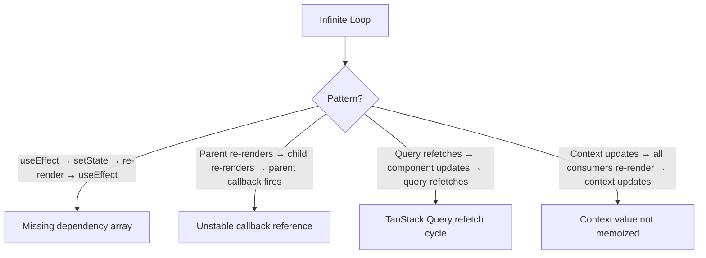

# Troubleshooting: React Render Loops

## Symptoms
- Component re-renders infinitely
- Browser tab becomes unresponsive
- Console shows repeated logs
- React DevTools shows continuous re-renders

## Root Causes



## Fix Patterns

### Fix 1: useEffect Missing Dependencies
```typescript
// ❌ BAD: Missing dep array → runs on every render
useEffect(() => {
    setCount(c => c + 1)
})

// ✅ GOOD: Empty dep array → runs once
useEffect(() => {
    fetchData()
}, [])

// ✅ GOOD: Explicit deps
useEffect(() => {
    setFiltered(profiles.filter(p => p.age > ageMin))
}, [profiles, ageMin])
```

### Fix 2: Unstable Function References
```typescript
// ❌ BAD: New function on every render
<Child onClick={() => handleClick(id)} />

// ✅ GOOD: Stable callback
const handleClick = useCallback(() => {
    handleClick(id)
}, [id, handleClick])
```

### Fix 3: Context Value Not Memoized
```typescript
// ❌ BAD: New object on every render → all consumers re-render
<AuthContext.Provider value={{ user, token, login, logout }}>
    {children}
</AuthContext.Provider>

// ✅ GOOD: Memoized value
const value = useMemo(() => ({ user, token, login, logout }), [user, token])
```

### Fix 4: TanStack Query Refetch Cycle
```typescript
// ❌ BAD: Query triggers state update that changes query key
const [filter, setFilter] = useState('all')
const { data } = useQuery({
    queryKey: ['profiles', filter],
    queryFn: () => fetchProfiles(filter),
})

// If filter is changed inside the component based on data → infinite loop
```

## Debugging

```bash
# 1. React DevTools → Profiler → Record
# 2. Check "Why did this render?" by adding:
console.log('Rendering:', componentName, props)

# 3. Add React.memo to break the chain
const Child = React.memo(({ data }) => { ... })
```

## Prevention
- ✅ Always specify dependency arrays in useEffect/useMemo/useCallback
- ✅ Memoize context values
- ✅ Use React.memo for pure presentational components
- ✅ Don't set state in useEffect without condition
- ✅ Don't derive state from props in render (use useMemo)
