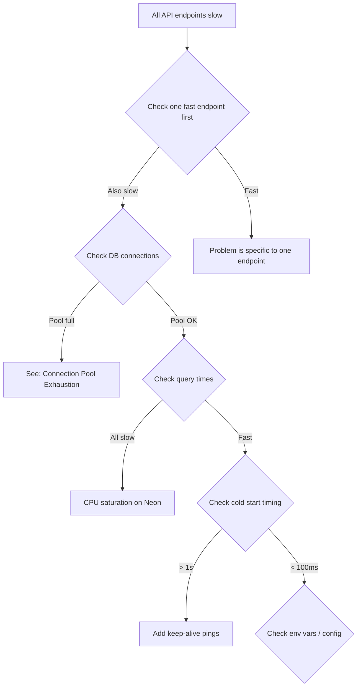

# Troubleshooting: API Bottlenecks

## Symptoms
- All API endpoints slow (not just one)
- High latency on every response
- Server-side rendering timeout
- Vercel dashboard shows high duration across all functions

## Root Causes

| Cause | Symptom | Solution |
|---|---|---|
| **DB connection pool full** | All queries hang | Check pool exhaustion guide |
| **No connection pooling** | Serverless creates new connection each time | Add pooled connection string |
| **Synchronous blocking** | Single slow endpoint blocks others | Parallelize or optimize |
| **Payload too large** | Request/response > 5MB | Paginate, compress, or stream |
| **No rate limiting** | Abuse overwhelms capacity | Add rate limiting |
| **Vercel concurrency limit** | 502 errors under load | Upgrade Vercel plan |

## Diagnosis Flow



## Quick Checks

```bash
# 1. Response time breakdown (add to controller):
const start = Date.now()
// ... handle request
console.log(`[${req.method} ${req.path}] ${Date.now() - start}ms`)

# 2. Vercel Function Insights
# Dashboard → Backend → Analytics → Duration

# 3. Neon query insights
# Dashboard → Query Analysis → Top queries by duration

# 4. Check for unoptimized queries
# Enable Prisma query logging
```

## Fix Patterns

### Fix 1: Add Response Caching
```typescript
// For rarely-changing data:
res.set('Cache-Control', 'public, max-age=60, s-maxage=60')
```

### Fix 2: Optimize Payload
```typescript
// Compress large responses (Vercel handles gzip)
// Or reduce response size:
select: { only: ['necessary', 'fields'] }
```

### Fix 3: Add Rate Limiting
```typescript
// Future implementation:
const limiter = rateLimit({
    windowMs: 60 * 1000,  // 1 minute
    max: 100,              // 100 requests
    // Use Redis for distributed rate limiting
})
```

## Prevention
- ✅ Monitor Vercel function duration regularly
- ✅ Profile slow endpoints proactively
- ✅ Set up alerts on Neon query times
- ✅ Load test before major releases
- ✅ Cache aggressively with TanStack Query
- ✅ Optimize payload size (select only needed fields)
