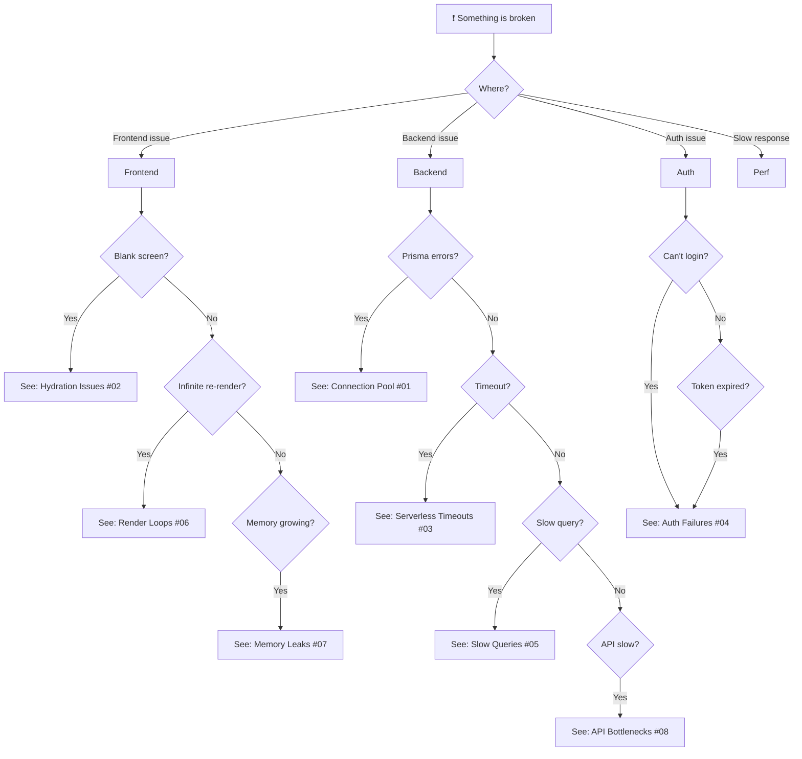

# Troubleshooting Guides

## Index

| # | Issue | Severity | Affects |
|---|---|---|---|
| [01](./01-prisma-connection-pool.md) | Prisma Connection Pool Exhaustion | 🔴 Critical | Backend |
| [02](./02-hydration-issues.md) | React Hydration Issues | 🟡 Medium | Frontend |
| [03](./03-vercel-serverless-timeouts.md) | Vercel Serverless Timeouts | 🟡 Medium | Backend |
| [04](./04-authentication-failures.md) | Authentication Failures | 🔴 Critical | Both |
| [05](./05-slow-queries.md) | Slow Database Queries | 🟡 Medium | Backend |
| [06](./06-react-render-loops.md) | React Render Loops | 🟡 Medium | Frontend |
| [07](./07-memory-leaks.md) | Memory Leaks | 🟡 Medium | Frontend |
| [08](./08-api-bottlenecks.md) | API Bottlenecks | 🟡 Medium | Backend |

## Decision Trees

## Quick Reference

| Symptom | Most Likely Cause | First Check |
|---|---|---|
| Blank white page | JS bundle failed to load | Browser console → network tab |
| API returns 500 | Unhandled error | Backend logs |
| API returns 401 | Token expired/missing | localStorage token exists? |
| API returns 403 | Wrong user role | User has ADMIN role? |
| Slow browse page | Missing index or N+1 | Prisma query log |
| Cant create booking | Date+session conflict | Check existing bookings |
| OTP not received | Email config issue | Check EMAIL_* env vars |
| Image not loading | Cloudinary URL wrong | Check Cloudinary env vars |
